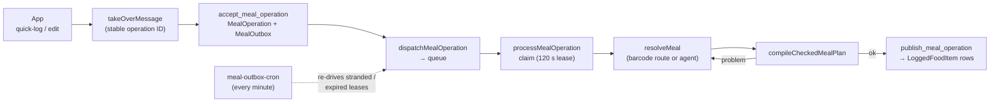

# Meal resolution harness

How a food log ("2 eggs and toast", a photo of a plate, a barcode) becomes saved `LoggedFoodItem` rows. Everything here
runs server-side; the app only submits a message and polls for progress.

The design in one sentence: **a model proposes, code decides.** The agent reads evidence through tools and returns a
structured plan; deterministic code checks that plan against the evidence, does all the arithmetic, and is the only
thing that publishes.

---

## 1. Lifecycle



| Step | Code | What it guarantees |
|---|---|---|
| Takeover | `src/mealOperations/takeover.ts` | App retries of the same submission hash to the same operation ID, so they're idempotent. The phone's timezone wins over the profile's. |
| Accept | `accept_meal_operation` RPC | One `MealOperation` row (state `queued`) plus an outbox row. |
| Dispatch | `src/mealOperations/dispatch.ts` | Enqueues to `/api/queues/process-meal-operation`. Delivery is at least once. |
| Cron | `/api/meal-outbox-cron`, every minute | Re-drives operations still `queued` after 15 s, and `running` ones whose lease expired (the function was killed). |
| Claim | `claim_meal_operation` | A worker token and a 120 s lease. A duplicate delivery can't claim, and a superseded one can't publish. |
| Publish | `publish_meal_operation` | Writes the meal revision and the same `LoggedFoodItem` rows the app already reads. Only the claim's token can publish. |

Operation states: `queued → running → succeeded | failed | retry_wait | needs_clarification | superseded | cancelled | conflicted`.

---

## 2. Models

Policy lives in `src/ai/models.ts`. Environment overrides can't swap in other providers; an unsupported value throws.

| Role | Model | Used for |
|---|---|---|
| Agent / first look / checks | `google/gemini-3.8-flash` (OpenRouter, Vertex first) | The agent loop, listing visible foods, coverage checks, locating barcodes (boxes only) |
| Decisions | `typesafe/jev-1.13` | Yes/no and choice questions with confidence: duplicate foods, "is this the same product?", "does the user refer to a past meal?" |
| Label reading | `anthropic/claude-sonnet-5.5` | Transcribing a nutrition label from a photo (never computing) |
| Food creation | `anthropic/claude-sonnet-5.5` (or Opus 5.5) | Cited web search that turns a page into a new catalogue food |
| Embeddings | `BAAI/bge-base-en-v1.5` | Catalogue and USDA nearest-neighbour search |

**Barcode digits never come from a model.** ZXing (`zxing-wasm`) decodes them. Flash may only draw boxes around bars
it can't read.

---

## 3. Inside `resolveMeal`

`src/mealResolution/resolve.ts`. One call covers one attempt at a meal.

### 3.1 Prefetch (in parallel, before any agent turn)

| Task | Purpose |
|---|---|
| Load photos | Short-lived signed URLs (never persisted or logged) |
| Decode barcodes | ZXing per photo: whole image, then 3×2 tiles, then a Flash-located crop at full resolution. A clear barcode takes about 30 ms. |
| First look | Flash lists each component the user is eating, with an estimated amount. This becomes the greyed preview in the app. |
| Prefetched foods | Catalogue foods nearest the whole meal text (embeddings) |
| Recent meals | The last 3 days of meal events, for "same as yesterday" references |
| Barcode matches | Catalogue foods already carrying a decoded GTIN |

Each prefetch is best effort: a failure just means the agent has to search.

### 3.2 Barcode route (no model turn)

When there's **no text**, **every photo decoded a barcode**, and the first look sees **nothing else**, each product is:

1. taken from the catalogue food carrying that GTIN, or else
2. looked up in USDA's branded record, then Open Food Facts, and added through the normal duplicate check (which
   attaches the barcode to an existing food when it's the same product),

then logged as one labelled serving. This starts as soon as the barcodes decode, alongside the first look, and is used
only if the first look sees nothing else. Anything unusual (text, extra foods, no source, an unclear duplicate) falls
through to the agent. A scanned branded product counts as new, rather than an unclear duplicate, when no candidate
shares its brand (a generic "Fruit Mixture, Frozen" is never the scanned bag). The result still goes through the
check in section 5.

### 3.3 Text fast route (Jev, races the agent)

For a **plain text meal** (no photos, answers, repair or edit) when `FeatureFlag.meal_text_fast_route` is `all` or
lists the user, `textFastRoute.ts` runs alongside the agent:

1. The text preview's listing (the same Flash call as the app's streaming preview) gives each item with the user's own
   words (`quote`) and a gram estimate. Each quote must be found verbatim in the text.
2. Per item, Jev picks the catalogue food from the search's top 8 plus the user's foods from the last 60 days that
   share a word (marked "logged before"), or none. A variant word the user didn't say (Elite, Zero, Light, Diet...)
   rules a food out. A pick under 0.9 gets its own yes/no question and needs 0.9 there.
3. Amounts: a stated mass ("153g", "1.16/2 lb") is computed in code; a unit the food has as a serving ("1 tbsp",
   "2 eggs") logs that serving; anything else is the listing's estimate (`estimated_mass`).
4. The plan goes through the normal check. "Same as yesterday" (Jev's past-meal question) always goes to the agent.

The first answer wins: a fast plan returns and aborts the agent; any miss (none, unsure, not verbatim, same food twice,
a check failure) just leaves the agent running, so a miss costs no time. Text eval with the route on: 17/17, 9 routed
in 1.6-2.8 s. The trace shows `fast_route: <reason>` or the foods picked; logs show `meal_text_fast_route`.

### 3.4 Agent loop

Built on the AI SDK's `generateText`, with a JSON output schema (`mealProposal`) and tools.

- **Up to 10 steps** per call. The last step, and any step after the answer deadline, runs with `toolChoice: "none"`
  so the model has to answer.
- **Parallel tool calls** are encouraged: "request all missing findFood calls in one turn".
- **Check and resume**: each resolved answer is checked by the backend (section 5). A problem is appended to **the same
  conversation** ("The backend checked this plan and found: …") so the evidence stays intact. Up to 3 attempts.
- An unparseable output gets one fresh retry. Provider errors retry twice with backoff.

---

## 4. Tools

| Tool | Reads / writes | Notes |
|---|---|---|
| `findFood` | Reads; may add **source candidates** | Catalogue first (any language, aliases, decoded barcode). Sources only when the catalogue has nothing, or when called again with `includeSources` for the same query: barcode record (USDA, then Open Food Facts) or USDA by name, then **cited web search** on a further call. |
| `addFood` | **Writes the catalogue** | Adds a source after duplicate checks. It may return an existing food (enriched with the source's barcode and servings), `possible_duplicates` (answer with `sameAs`), or `recheck_estimate` when an estimate's energy density is far from similar foods. |
| `attachBarcode` | **Writes the catalogue** | Puts a decoded GTIN on a shared food that Jev confirms is exactly the scanned product. Refuses foods with another barcode or a sibling variant. |
| `readLabel` | Registers a label source | Sonnet transcribes the label in 3 orientations; code converts the chosen column. Returns a `sourceId` for `addFood`. |
| `proposeLabelFood` | Registers a source | Only for nutrition facts the **user typed**, copied exactly. |
| `proposeEstimatedFood` | Registers a source | Last resort (a homemade dish): per-100 g values with a written basis. `personal: true` saves it privately. |
| `getFoodsAndServings` | Reads | Authoritative serving weights and nutrients for foods already discovered. |
| `listMealEvents`, `getMealEvent` | Reads | History, limited to before this meal was submitted (a later edit is never a reference). |
| `calculate` | Pure | All arithmetic ("3/8 * 400"). The model is told never to do sums in its head. |

**Discovery rule:** a plan can only use a food the meal has actually seen, from prefetch, `findFood`, `addFood` or
`getFoodsAndServings`. Invented IDs fail with `unread_catalogue_food`.

> Only `addFood` and `attachBarcode` write, and only to the shared catalogue (`FoodItem`, `Serving`). No tool writes a
> meal: that happens only in `publish_meal_operation`, after the check.

### Where a missing food comes from

```
catalogue ─► barcode databases (USDA record → Open Food Facts) ─► USDA by name ─► cited web page ─► label in the photo ─► marked estimate
```

The catalogue is the cache: whatever a later step finds is saved as a `FoodItem` (or enriches one), so the next log
is a catalogue hit. Duplicate checks (`duplicateOf` in `foodSources.ts`) settle on the barcode first (the same GTIN is the
same food, a different one is another product), then brand, then Jev with confidence ≥ 0.9, otherwise the agent decides.

---

## 5. The check (`compileCheckedMealPlan`)

`src/mealResolution/compile.ts` and `historyCheck.ts`. The model's plan names foods and quantities; this code computes
grams and nutrients and rejects anything unsupported. Each rejection carries a detail telling the agent what to fix.

| Code | Meaning |
|---|---|
| `unsupported_meal_mention` / `dropped_meal_mention` / `uncovered_meal_item` | Every mention in the text (or `photo: …` observation) maps to items, and every item to a mention. |
| `unread_catalogue_food` / `missing_catalogue_food` | A food not discovered in this meal, or an item with no food. |
| `invalid_food_serving` | A serving ID that isn't a usable serving of that food. The detail lists the valid ones. |
| `unread_history_food` / `unread_history_group` | A copied past item or group whose event wasn't read with `getMealEvent`. |
| `history_not_referenced` | History was copied, but Jev says the user's words don't refer to a past meal. A lookalike photo isn't a reference. |
| `barcode_not_covered` | A decoded barcode, but no item is the food carrying it. |
| `duplicate_food_in_group` | The same food twice in one dish. |
| `nutrition_claim_conflicts_with_food` | A number the user stated ("200 kcal") disagrees with the chosen food. |
| `invalid_meal_nutrition` | Grams or nutrients outside sane bounds. |
| `missing_visible_food: …` | Second look: the first look saw components the plan didn't log. |

The first attempt includes the second look. It compares the plan with the first-look list (text only, about 1 s) instead
of re-reading the photos.

---

## 6. Time budgets

| Limit | Value | Where |
|---|---|---|
| Vercel function | 120 s (`maxDuration`) | `process-meal-operation/route.ts`. Being killed records nothing; the cron re-drives it after the lease. |
| Worker lease | 120 s | `claim_meal_operation` |
| All resolver calls in one delivery | 95 s, shared | `worker.ts` `RESOLUTION_BUDGET_MS`. A repair with < 20 s left fails as `provider_timeout` and is retried. |
| One `resolveMeal` | its budget (default 90 s) | Aborts every provider call. |
| Answer deadline | budget − 25 s (at least half) | After it, the model must answer instead of calling tools. |
| History window | submittedAt + 60 s | Later events are invisible to history tools. |
| Photo fetch / barcode locate | 8 s / 6 s | `readPhotoBarcode`, `locateBarcodesWithFlash` |
| USDA / Open Food Facts | 6 s / 5 s | `foodSources.ts` |
| First look / second look | 15 s / 10 s | `coverageCheck.ts` |

## 7. Failure handling

- **Worker-level repair:** if the final plan fails a check with a known code, the worker calls `resolveMeal` once
  more with `validationErrorCode`, then checks without a second look.
- **Clarification:** the current app can't show questions, so taken-over meals resolve with stated assumptions
  (`clarificationAllowed: false`). A plan that still asks fails as `meal_needs_clarification`.
- **Retries:** transient codes, timeouts, rate limits and `resolution_failed` go to `retry_wait` for 30 s, up to 3
  attempts. After that the operation is `failed`.
- **Fencing:** a late delivery whose claim changed, or whose meal revision moved on, is ignored and never overwrites the result.

## 8. Progress for the app

`report_meal_operation_progress` writes `{stage, startedAt, preview}` for the claim. Stages only move forward:
`reading | matching → found → checking → saving`. The preview is the first look's components (or, for text, a
streamed item list), with catalogue icons once candidates are found. The saved meal replaces it.

After the meal is saved, foods without an icon go to the icon queue (`generate-food-icon`). It shortlists the 8
closest icons by name embedding (`food_icon_candidates`; the old flat `*_(no_bg)` drawings are never reused), and Jev
picks the one that shows the food or says none fits (`chooseFoodIcon`). An unsure pick is confirmed on its own; a
reuse needs 0.9 confidence. Otherwise a new icon is drawn. Without Jev, only a name scoring 0.85 or more is reused.

## 9. Debugging a meal

1. **Find the operation.**
   ```sql
   select id, state, "errorCode", attempts, "createdAt", "completedAt"
   from "MealOperation" where "messageId" = <id> order by "createdAt" desc;
   ```
2. **Read the logs** for that window (Vercel keeps them briefly):
   ```bash
   vercel logs --environment production --since <start> --until <end> --json
   ```
   Look for:
   - `meal_resolution_resume`: each check problem the agent was asked to fix, with its step count
   - `meal_resolution_failed`: the tool trace (status and IDs only, never user text)
   - `meal_operation_complete`: final state, duration, per-stage timings and tools on success
   - `Task timed out after 120 seconds`: the function was killed; the cron will re-drive it
3. **Reproduce.** `decodeBarcode`, `createFoodSources(...).barcodeSources` and the checks run locally with
   `ts-node`, and `tests/meal-*.test.cjs` shows how to stub evidence and sources. `scripts/reprocess-meals.ts`
   re-resolves a real message. It writes to production.

## 10. Invariants worth keeping

- Models choose and describe; code owns numbers, barcodes, duplicate checks, inserts and publication.
- Barcode digits come only from the decoding library.
- Every logged item references a `FoodItem`. A missing food is created (through the source ladder), never skipped.
- Tools see only this user's private foods plus shared ones. Barcodes go only on shared foods.
- Signed photo URLs never leave the attempt. Logs carry IDs and statuses, never meal text.
- Photo-only meals are new meals: history is copied only when the user's words refer to it.
