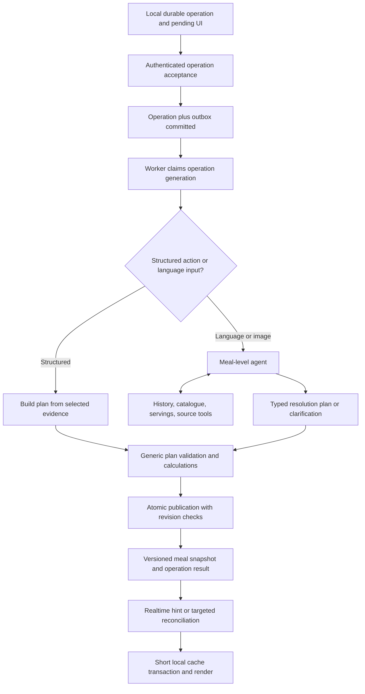

# Amino meal pipeline replacement — implementation handoff for Sol

Prepared September 24, 2026. Revised September 25, 2026. Implement in `amino-server` and `amino-mobile`.

**Revision (25 September 2026).** After a production matching failure (Appendix A), the user added these requirements:

1. Images go through the same meal resolver as text. The image-only legacy route is removed, not kept as a special path.
2. When the resolver fails, it escalates to a *more* capable agentic attempt (repair, bigger budget, external evidence, clarification). It never falls back to the legacy matcher (§7, "Escalation instead of legacy fallback").
3. Before any English/keyword rule is deleted, the domain protection it gave, especially calorie-density distinctions such as dry versus cooked rice, must be held by language-independent tests and evaluations (§13, "Calorie-density invariant suite"). Deleting a rule must not quietly lose that protection.
4. The agent must stay fast. The common path is designed around one or two model turns (§14, "Speed design"). The broad budget is only for escalation.

## 1. Assignment

Replace the patch-driven food pipeline with a multilingual, meal-level AI resolver that can fetch history, catalogue foods, servings, and external evidence. Make submit, edit, and portion saves feel immediate while preserving reliable delivery and accurate, atomic server publication.

The user explicitly rejected food-specific keyword rules and English parsing as the semantic foundation. Do not solve the audit by adding synonyms, translated regexes, dish-name lists, or more special-case prompts. The agent must have the context, tools, and output contract to perform the task.

Read the [architecture audit](/Users/seb/Documents/GitHub/amino-server/pipeline-architecture-audit.md) first. It contains the findings, source references, provenance, and executable counterexamples. This plan supplies implementation decisions, dependency order, tests, and completion criteria. Implement the complete path; a new agent disconnected from persistence or the mobile app is not completion.

Expected deliverables:

1. Versioned contracts and a tested meal-resolution agent with evidence tools.
2. Durable operation acceptance, worker claims, and atomic publication of meal revisions.
3. Mobile operation outbox, optimistic pending UI, and revision-aware sync without network-spanning global locks.
4. Unified handling of text, history references, edits, images, barcode evidence, and explicit portion/date actions.
5. Removal of semantic keyword rewrites and incompatible fallback behavior from the new pipeline.
6. Deterministic regressions, actual database concurrency tests, multilingual model evaluations, and measured iPhone latency.
7. Build/release artifacts, migration and rollback instructions, plus an honest results report.

This document authorizes no deployment by itself. In the implementation task, follow the user's current deployment instructions and established authorization. Complete implementation and verification before any release checkpoint. Phone installation was deferred in the source conversation; do not assume the device is currently available.

## 2. Starting state and repository discipline

Recheck these facts before editing; they describe the audit snapshot, not a promise that branches have stayed unchanged:

| Area | Audit snapshot | Required handling |
|---|---|---|
| Production server | `b09e3c5f927007983ebca94d97b30eb44e0ff1e2`; deployment `amino-1ynae2i7f-hedge.vercel.app` | Verify current deployed commit and relevant feature flags. |
| Isolated hotfix checkout | `/private/tmp/amino-smoothie-server`, clean at that commit | Useful baseline only; confirm it still exists. |
| Main server checkout | `/Users/seb/Documents/GitHub/amino-server`, HEAD `1a957f3` with uncommitted history hotfix equivalents | Includes separate model-cleanup work that is not the deployed baseline. |
| Model cleanup | `981291c` and build follow-up `1a957f3` | Has an ASCII identity collision and an unpassed external-search gate. Do not accidentally ship it wholesale. |
| Mobile | `/Users/seb/Documents/GitHub/amino-mobile`, extensive dirty tree | Preserve unrelated work and establish which changes belong to this implementation. |
| iPhone build | A signed build exists, but it predates this replacement | Build a fresh artifact when app implementation is complete. |
| Live text resolver (25 Sep) | `FOOD_FAST_SELECTOR=on` and `FOOD_AGENT_FALLBACK=on` at 100% since 23 Sep ([FOOD_LIVE.md](FOOD_LIVE.md)). The Jev → Gemini per-food cascade handles text only. Photos, barcodes and exact-name matches bypass it, and any abstention falls back to legacy. | Treat as the current baseline. The per-food cascade, `validateProposal` quantity grammar and legacy fallback are what this plan replaces. |
| Untracked work | This plan, the audit, `pipeline-audit-evidence/` and uncommitted history edits in `src/foodResolution/history/*` exist in the main checkout | Establish ownership before editing; do not overwrite. |

Inventory Git state, applicable `AGENTS.md`, existing tests, migrations, queue deployment, and the installed SDK versions. Use an isolated `codex/` branch/checkpoint where appropriate. Never reset either dirty working tree or silently include unrelated changes. Produce a short baseline manifest recording server/app SHAs and dirty changes, migration state, model/config versions, and build identity.

Use the repository Supabase skills when designing/implementing database changes. Verify current Supabase/queue/SDK documentation before depending on APIs. Preserve owner checks and the existing service-role-only transaction approach. Do not bulk export production secrets. Read-only metadata and targeted configuration inspection are sufficient for baseline discovery.

Run the [audit probe](/Users/seb/Documents/GitHub/amino-server/scripts/food-baseline/audit-pipeline.cjs) once to preserve characterization evidence. It intentionally describes existing bad behavior; do not use its current expectations as the new acceptance contract. Add separate desired-behavior tests.

## 3. Product behavior and non-negotiable boundaries

### User-visible behavior

- Submit and Save persist a local operation and immediately show a pending meal/change. They do not wait for AI or network resolution to dismiss an editor.
- A new log has a visible pending message immediately. Foods appear when a validated meal result is published. Do not invent provisional nutrition just to make rows look complete.
- During an edit, retain the last successful foods and nutrition. Show the proposed change as pending. On failure, the last successful meal remains internally consistent and the proposed input is recoverable.
- Connectivity and delivery are different states. An online request failure is not labeled “offline.”
- “Same smoothie as yesterday” means the referenced smoothie with its component foods. This follows from the historical meal structure/context; no smoothie branch is allowed. Apply the same capability to soups, sandwiches, dishes, drinks, and meals in any supported language.
- Support changes such as omission, substitution, relative quantity, and a referenced meal plus additional foods. Fetch evidence and reason over the group; do not refuse a request merely because it contains “without” or “instead.”
- Ask a focused clarification only when unresolved ambiguity materially changes the result. A named authoritative bowl/cup/portion is enough evidence to calculate quantity, regardless of the language used to request it.
- Explicit portion, date, delete, or catalogue-selection actions need no model call. They still use the same operation, validation, and revision rules.

### Responsibility boundary

| AI responsibility | Deterministic backend responsibility |
|---|---|
| Language, intent, referents, relative dates in context | Authentication, visibility, ownership, allowed operation types |
| Dish/ingredient grouping, identity, preparation, brand | Evidence ID existence, source versions, serving-to-food relationships |
| Quantity meaning and nutrient scope | Units, arithmetic, finite values, consistent quantity/grams/nutrition |
| Selection of appropriate evidence and handling ambiguity | Idempotency, transactions, concurrency, retries, publication |
| Explainable assumptions or an appropriate clarification | Preserve original input, source provenance, uncertainty and operation status |

Keyword search may retrieve candidates. A barcode or user-selected catalogue ID may identify evidence. Neither text normalization nor a high embedding score establishes all of a food's identity and quantity. A fast path must produce the same validated plan as every other path.

Do not convert every uncertainty into refusal. Existing Amino behavior permits normal food-logging portion estimates. Preserve that capability consistently: represent a reasonable serving estimate as an estimate with a basis, not as a sourced measurement. Never invent a product label or pretend missing nutrition was found in a source. When missing identity or quantity is consequential and cannot be supported, ask. Make this policy explicit in the resolver and evaluations rather than allowing legacy fallback to silently choose a different policy.

## 4. Target architecture



One orchestrator owns the meal plan. It can fetch independent food evidence in parallel. It does not need one model call per food or another standalone model call solely to decide meal time. Icons, taxonomy enrichment, diagnostics, and shadow comparisons run after publication or on separate jobs.

Keep the first implementation small: typed contracts, an operation service, an evidence layer, a resolver, a calculator/validator, a transactional publisher, and a mobile outbox. Avoid a generic workflow engine or a proliferation of agents and microservices.

## 5. Contracts

Implement runtime schemas as well as TypeScript types. Version every wire/plan schema. Prefer a shared generated contract or schema fixture checked in both repositories; do not create two independent handwritten definitions that can drift. The shapes below are design guidance; choose exact repository naming once and document it.

### Submission

```ts
type MealOperationRequest = {
  schemaVersion: 1;
  operationId: string;             // Client UUID, stable across delivery retries.
  clientMealId: string;            // Stable UUID before a server Message ID exists.
  messageId?: number;
  expectedPublishedRevision: number | null; // null for creation only.
  action: 'create' | 'replace' | 'portion' | 'move' | 'delete';
  submittedAt: string;             // Immutable client capture time, UTC ISO.
  timezone: string;                // Valid IANA timezone.
  locale?: string;
  proposed: OperationInput;        // Strict discriminated union by action.
  supersedesOperationId?: string;
};
```

`OperationInput` must make the valid fields explicit:

- Create/replace: original text, selected consumption instant, attachment IDs and optional voice transcript metadata. Image references are stable owned IDs, not expiring signed URLs.
- Portion: target logical food ID, explicit selected serving ID or canonical mass, quantity, and the expected food/meal version. Server calculates the authoritative grams/nutrition; supplied UI values are previews only.
- Move: target meal/food and new consumption time; use one transaction for related rows. Preserve individual-food versus whole-meal scope explicitly.
- Delete: explicit target scope, version, and tombstone publication. Represent individual-food deletion as a new meal revision; do not leave progress counts inconsistent.

Derive user identity and entitlement from authentication, never from request/tool arguments. Validate payload size and attachment ownership before acceptance. Hash a canonical normalized *structural payload* for idempotency; do not normalize the natural-language content semantically.

### Durable response and lifecycle

Return `202` after durable acceptance, before model work; return `200` for an already completed identical operation. Include `operationId`, server `messageId`, accepted generation, operation version, published revision, state, and status URL. Use typed `409` conflicts and `422` invalid requests. A request timeout does not mean the operation failed.

Server states:

```text
queued -> running -> succeeded
                  -> needs_clarification -> queued (after versioned answer)
                  -> retry_wait -> queued
                  -> failed
                  -> conflicted
queued/running/retry_wait/needs_clarification -> cancelled or superseded
```

Use a monotonic `operationVersion` for state updates. Terminal success never becomes failure because a late attempt timed out. Store machine-readable error codes with retryability and localized user copy; do not require the app to interpret an English error string.

Repeat delivery of the same key and same payload returns the same operation. Same key/different payload returns a conflict. Network retry retains the key. A deliberate retry after a terminal failure creates a new operation referring to its predecessor and the current published revision. Clarification answers append to the existing operation under expected operation version; the original input stays immutable.

### Meal resolution output

The agent proposes a plan, not database mutations. A plan must represent:

| Field | Requirement |
|---|---|
| `schemaVersion`, context references | Bind proposal to the current operation/input version. |
| Outcome | `resolved`, `needs_clarification`, or a typed unsupported/insufficient-evidence result. Transport failure is an orchestration error, not a semantic outcome. |
| Consumption time | Exact proposed instant and source: selected, explicit-language interpretation, or default capture time. |
| Groups | IDs and labels for whole meal/dishes/components, with parent relationships. |
| Items | Stable logical IDs, group membership, food evidence reference or historical item reference, quantity specification, and evidence links. |
| Facts | Original source spans, brand/preparation/variant attributes and scoped nutritional claims. |
| Assumptions | Structured origin and reason for supported estimates, kept separate from explicit user facts. |
| Coverage | Which user/source facts each item/group accounts for, including requested omissions and transformations. |
| Clarification | A concise question and optional evidence-backed choices in the user's language, without exposing internal IDs. |

Historical copy should reference source revision + logical item IDs + explicit scale/transformation. The backend expands approved references to the source snapshot. Avoid asking the model to retype historical nutrition or ingredients. The model may choose a whole group or specific items; code validates membership, not the meaning of the group's name.

Example semantic case: a historical smoothie is one group containing powder, fruit, milk, and seeds. The agent selects that group, and the publisher expands all four. If the event also contains an unrelated side dish, the agent examines the event and user wording to choose scope. The user's known smoothie case includes all its associated components; do not assume that every historical event is necessarily one dish forever.

### Quantities and nutrient claims

Use a quantity union such as mass, volume with density evidence, authoritative serving count, historical scaling, or explicitly marked estimated grams. Support canonical units and food-specific serving IDs without a fixed list of food names. Numeric parsing of an explicitly selected UI field is fine; re-parsing the raw sentence with English regexes is not.

Preserve these distinct fields: requested amount/unit; selected serving ID; serving basis amount/weight; calculated grams; display quantity/unit; confidence/origin of any estimate. Check they agree. Never replace the serving ID because another serving evenly divides the grams.

Nutrient claims carry nutrient, value, canonical unit, relation (`equal`, `approximate`, `minimum`, `maximum`), basis (`consumed`, `per_serving`, `per_100g`), role (`label_identity`, `portion_target`, `group_total`), affected item/group IDs, and original evidence span. Allow explicit zero. Null means unknown. Unit conversions and fact scope must survive translation.

Examples of required distinctions: “a bar with 20 g protein” identifies a label; “enough yogurt for 20 g protein” determines a portion; “700 calories for that entire salad” constrains a group. Do not scale the wrong product until it happens to meet a label claim. Do not assign a group total to every child. If a group total is underdetermined, preserve it as a claim and clarify or mark an explicit estimate; do not fabricate an arbitrary component allocation.

An estimated quantity is a normal, first-class result, not a failure. For example, "half of a large bowl of tuna ceviche" from a photo is estimated grams, with the observation and reasoning recorded as its basis. The validator checks that the estimate is finite, plausible for its declared unit and consistent with its grams. It must not require the portion to be written in a fixed English grammar. Clarify only when the portion is truly unknowable and makes a material difference.

### Food attributes that change energy density

Several removed rules existed to protect distinctions that change calories per gram several-fold. Today they are enforced by English regexes over food names (`cooked`/`raw`/`dry`, milk `%`, `oil`, `avocado`…). Replace them with a language-independent data contract rather than dropping them:

- The plan declares **requested attributes** for each item, each with a source span or image observation. Use a small closed vocabulary with an explicit `unspecified` value: preparation state (dry/uncooked, cooked-in-water, fried, roasted/grilled, raw), form (whole, powder/concentrate, prepared/reconstituted, juice, dried), fat/sugar variant (a fat percentage or a named variant; sweetened/unsweetened; regular/light/zero), packing medium (in oil, in water/brine), and explicit energy-bearing additions.
- Catalogue foods get the **same attributes as structured data**. Generate them offline with the existing two-stage Jev classifier pattern (confidence ≥ 0.9, abstain otherwise) and store them versioned with provenance. Unknown stays `unspecified`; never infer it from an English name at request time.
- The generic validator rejects a proposal when a requested attribute that is not `unspecified` contradicts a catalogue attribute that is not `unspecified`. When the catalogue value is unknown, the agent must look at more evidence or record the match as an assumption. This is a data comparison, not a keyword parser, so it works the same whatever the input language.
- Additions are **covered or explained**. Every requested addition is covered by a separate item, by a composite food whose attributes include it, or by an explicit assumption. Each addition is counted once. An addition that the same meal already logs as its own item counts as covered; its leftover wording on the base item must not fail it (Appendix A).

## 6. Evidence and tool layer

Tools are read-only from the agent's perspective. They operate with an authenticated server capability bound to the operation. Keep query parameters structured, validate limits, and project only relevant data. Every tool returns a typed result distinguishing data, empty result, temporary failure, forbidden/unavailable evidence, and truncation with a cursor.

| Tool | Inputs | Returns / required behavior |
|---|---|---|
| `listMealEvents` | Structured UTC time window, optional semantic query, cursor | User-owned event summaries with date, group information, revision and next cursor. No English date/meal keyword inference inside the tool. |
| `getMealEvent` | Event ID, optional revision | Complete original text, structured groups, published food/portion/nutrition snapshot, attachments metadata and provenance. Server enforces ownership. |
| `searchFoods` | Query, optional structured attributes, cursor | Shared/owned visible catalogue candidates, aliases and retrieval evidence. Search rankings are hints, not verified identities. |
| `getFoodsAndServings` | Discovered food IDs | Authoritative food identities, servings, nutrition basis and source/version, in a batch. |
| `lookupBarcode` | Barcode string | Exact product evidence, variant/region details and sources. Preserve leading zeros. |
| `searchFoodSources` | Food identity and missing facts | External candidate sources with retrievable supporting content; does not write catalogue rows. |
| `readFoodSource` | Approved source reference | Bounded content/extracts, retrieval time and provenance for factual verification. |

Semantic searches should support aliases and multilingual queries. Evaluate a multilingual embedding/index strategy or an explicit model-generated multilingual/English query expansion strategy; do not silently assume the current English BGE index is sufficient. If the embedding model changes, version and build a compatible index alongside the old one. Never mix vectors from different models/dimensions in one similarity calculation. Cut over only after retrieval evaluations.

History needs both time-window enumeration and semantic lookup. A query term mismatch must not hide all yesterday's events from the agent. For “usual,” retrieve sufficient repeated evidence with paging; do not define usual through a universal hard-coded frequency or fixed breakfast hours. Present repetition statistics as evidence for reasoning.

Represent each piece of evidence with an ID, source kind, source owner/visibility where applicable, record/version, retrieved time, and bounded supporting fields. Persist the evidence used for the published result according to retention policy. Do not store or expose provider secrets, signed URLs, or unrestricted user objects in logs.

Catalogue visibility must be explicit before these tools go live. Confirm whether `FoodItem.userId` means private ownership or import attribution. Enforce the actual policy consistently in API, vector search and hydration; strip originating `messageId`/other-user metadata from shared search responses. Do not guess a global `userId IS NULL` rule if the existing catalogue uses the field differently.

External import is a backend operation following validation of the agent's evidence-based proposal. Require an exact product/variant, a nutrition basis, and supporting source extracts, not just a URL included among citations. Reuse trusted database facts where available. Unknown values stay unknown. Deduplicate imports with stable source/product keys and transactions. Do not create extra catalogue entries merely because retrieval was temporarily unavailable.

## 7. Resolver and validation

### Model orchestration

Start with one capable model behind a provider adapter. The implementation task's use of Sol does not prescribe Amino's runtime model. Retain compatible configured providers where appropriate; select or change a runtime model based on tool-use, multilingual quality, latency, and cost evidence. Keep model/prompt/tool-schema versions in results.

Give the resolver the original text, immutable temporal context, proposed attachments, previous published meal for edits, user locale, available tool descriptions, and any safely prefetched evidence. It determines extraction, grouping, referents, consumption time, quantities, and missing evidence within one coherent plan.

Use actual tool calling and runtime schema validation. Read useful prefetched evidence in the first turn; batch independent IDs and parallelize independent reads. Cache within the operation. Permit a direct proposal when evidence is complete. Make tool/deadline budgets configurable and measure their effect. The six-step, sixteen-retrieval, 30-second envelope is the **tier-3 ceiling**, not the default. The common path uses the tier-1 budget (§7 escalation table, §14 speed design). These are tunable resource limits, not a recipe every meal must follow. Use explicit cancellation and bounded retries.

Avoid two-model cascades until a baseline shows that a selector materially improves latency/cost without suppressing valid choices. If retained, it selects among evidence-backed structured plans under the same contract. It cannot prefilter valid options through the old household grammar or silently route hard cases to permissive legacy code.

On schema/integrity failure, provide precise machine-readable feedback to the resolver for at most a bounded repair attempt. An unavailable tool is retried according to infrastructure policy, not described to the model as proof that a food doesn't exist. Budget exhaustion remains recoverable and visible; it does not invent a completed meal.

### Escalation instead of legacy fallback

Resolution is one agent with increasing effort, not a chain of different pipelines with different policies. Each tier uses the same plan contract, validator and publisher:

| Tier | When | What changes | Starting budget (tunable) |
|---|---|---|---|
| 0. Structured | Explicit portion/date/delete/catalogue selection, confirmed barcode ID | No model. | — |
| 1. Fast | Every language/image input | Flash (low reasoning), prefetched evidence, may finish in its first or second turn (§14). | ≤ 2 model turns, ≤ 6 retrievals, 8 s |
| 2. Repair | Validator rejection of a tier-1 plan | The *same session* gets machine-readable validator feedback (e.g., `attribute_conflict: preparation requested=dry catalogue=cooked`, `addition_uncovered: avocado`). | +1 turn |
| 3. Deep | Missing/insufficient catalogue evidence, low confidence, repeated rejection | Higher reasoning effort, wider catalogue/history paging, `searchFoodSources`/`readFoodSource`, evidence-backed import proposal. The pending state stays visible to the user. | ≤ 6 turns, ≤ 16 retrievals, 30 s |
| 4. Ask / insufficient | Material ambiguity or no supportable evidence | `needs_clarification` in the user's language, or a typed insufficient-evidence result. | — |

The legacy matcher is never a tier. A result that tier 3 cannot support is not handed to code with a looser policy. The tier reached, the reason for each escalation and the budget used go into provenance and telemetry. The tier-1 rate and the escalation reasons are the main metrics for tuning the speed design.

**Legacy retirement is blocked by tier 3's catalogue-miss capability.** Today only legacy handles foods missing from the catalogue (USDA/external DB lookup via `findAndAddFoodItemInExternalDatabase`, online import via `getFullFoodInformationOnline`). The Exa replacement failed its source-quality gate (21/40; [ai-model-implementation-status.md](ai-model-implementation-status.md)). Wrap the existing USDA/Nutritionix/FatSecret integrations as `searchFoodSources` evidence adapters, measure them against the same gate, and only then remove legacy. Otherwise catalogue misses turn into hard failures.

### Generic validator

Implement distinct structural, capability, calculation, and publication checks:

1. Strict schema, valid references, acyclic group structure and bounded payloads.
2. Evidence supplied to this operation; authenticated ownership/visibility; valid catalogue, source and serving IDs.
3. Versioned historical evidence and complete referenced group membership.
4. Finite quantities and valid dimensions; named serving arithmetic; density required for volume-to-mass where the source basis needs it.
5. Nutrition calculated once from authoritative bases or historical snapshots; preserve unknowns, explicit label facts and provenance.
6. No accidental double counting of a group aggregate and its components. Multiple genuinely consumed instances of the same food remain valid; do not deduplicate by food ID alone.
7. Consistency of the declared facts, quantities, source links, totals and transformations. This validates the model's structured interpretation; it cannot mathematically prove that every nuance of raw natural language was understood.
8. Current expected meal generation, operation lease and relevant source versions at publish time.

Use source-span checks for fidelity to the original input, including a clearly defined Unicode offset convention. Do not require English nutrient or portion patterns to approve those spans. Semantic accuracy is established through model/evidence behavior and evaluations, not another keyword parser disguised as validation.

Preserve nutrition sanity bounds as explicit domain policies with units and explanations. Review inherited fixed 5 kg/45,000 kcal limits for batch recipes versus a consumed portion; they must not become unexplained semantic rejection rules.

## 8. Database model and transactions

Use additive migrations and maintain the current `Message`/`LoggedFoodItem` projection for compatibility. Prefer three new durable concepts rather than a large event-sourcing framework:

| Concept | Minimum contents |
|---|---|
| Meal operation | Owner, client operation key, client meal ID, message ID, immutable input and request hash, expected published revision, generation, operation version, state, attempt/lease, next retry time, proposed plan/evidence, result/error, timestamps, schema/model versions. |
| Published meal revision | Message ID, monotonically increasing revision, operation ID, immutable text/time/attachment/group/food/nutrition/provenance snapshot, publication time, deletion state. |
| Transactional outbox | Event ID/type, operation ID/generation, dispatch state, attempt count, available time, lease. Used for reliable resolution dispatch and optional post-publication jobs. |

Add current published revision, operation generation, and pending operation reference to the message projection. Associate current food rows with a published revision and stable logical item ID. Preserve row IDs for unchanged logical foods where feasible; additions/removals receive explicit mappings/tombstones. A revision snapshot must reproduce the committed result without rerunning a model or looking up mutable catalogue nutrients.

Use unique constraints for `(owner, clientOperationId)` and client meal identity, and `(messageId, publishedRevision)`. Index owned operation status queries, pending dispatch, and history date windows. Use partial indexes where the actual predicates justify them. Verify query plans on representative data rather than indexing every JSON field.

New operations/revisions exposed through the Data API require RLS and deliberate grants. Agent/model output never directly invokes an admin write. Internal transactional functions should follow the repo's service-role-only `SECURITY INVOKER` pattern where suitable, with authenticated owner checks inside the application and transaction. Verify live policies and revoke unintended execution privileges. Regenerate schema types after migration validation.

### Acceptance transaction

1. Resolve the authenticated owner and check structural entitlement/input requirements outside model processing.
2. Look up the idempotency key first; return the original operation for identical retries even if the meal revision has since advanced.
3. Lock the target message briefly, or create an empty unpublished message shell tied to `clientMealId` for a new log.
4. Check the expected published revision and active-operation policy.
5. Increment generation, record the proposed input as an operation, set pending reference, and insert an outbox event atomically.
6. Commit and acknowledge. No model, queue-network, storage fetch, or other external request inside the transaction.

For the first implementation allow one active operation per meal. A conflicting second operation returns the active operation/version. Explicit supersession may cancel that operation and advance generation atomically. Do not silently overwrite it. Unrelated meals remain independent. Mobile may let the user replace their pending edit, but must send explicit supersession rather than a duplicate request with new content.

### Dispatch and worker claims

Dispatch committed outbox records with leases and stable queue deduplication keys where supported. At-least-once queue delivery is expected; correctness cannot depend on exactly-once transport. A crash after enqueue but before marking dispatch complete may resend, so the worker must claim the operation with a generation and fencing token before processing.

Use bounded leases, attempt counters, heartbeats where needed, and a reaper for abandoned work. Each claim gets a monotonic fence/attempt token. Provider calls happen outside database locks. Old attempts can finish late but cannot publish. Persist enough validated state/evidence to avoid starting every transient retry from zero. Cancellation must abort cancellable requests and prevent writes even when a provider ignores abort.

### Publish transaction

1. Lock the target and required sources in a consistent order.
2. Verify owner, nondeleted target, expected published revision, current operation generation, active lease/fence, input version and nonterminal cancellation status.
3. Revalidate referenced source revisions and relevant catalogue/serving evidence version or content hash. For a source changed during an attempt, re-resolve against current evidence; do not silently publish a mixture of versions.
4. Insert the immutable successful revision and update the current message text/time/attachments and food projection together. Remove superseded rows through tombstones in that same transaction.
5. Mark the operation successful with resulting revision/result, clear pending state, and create optional post-publication work atomically.
6. Commit. Publish/reconcile the complete snapshot; optional icon or category failures cannot revert success.

A failure before commit leaves the previous revision untouched. A lost response after commit is recovered by operation ID. A failed/cancelled attempt records only its operation result; it does not change the last successful food/text projection.

Copy unchanged historical nutrition exactly from the pinned source snapshot. If a requested scale changes quantity, recompute from that snapshot's basis, preserving user overrides and nulls. Do not silently refresh an old meal from today's catalogue. Retain source revision and item provenance.

### Compatibility and legacy writers

This is a migration requirement, not optional cleanup. Old mobile versions write message fields directly, and old queue jobs update food rows without revision checks. They can bypass the new operation design unless addressed.

- Put new operations behind a server capability/cohort gate; identify new-protocol-owned meals.
- Modify old mutation endpoints and worker update helpers to check legacy eligibility and reject/ignore writes to new-protocol-owned meals. A check only at worker start is insufficient; enforce at final write.
- Audit direct authenticated table writes/RLS/grants. For new-protocol-owned meals, protect published fields at the database boundary or deny the old write route. Owner equality alone does not protect revision consistency.
- Older clients must retain read compatibility and get a truthful upgrade/conflict response if they try to mutate protected meals. Test this deliberately; a minimum client version may be needed for full mutation rollout.
- Drain or safely fence existing work before cohort transitions. Do not drop old schema/functions until clients and in-flight jobs no longer need them.
- Rollback can route **new** eligible operations away from the new resolver, but must not send already accepted versioned operations to an unfenced legacy worker. Keep enough compatibility code to read and safely finish/cancel them.

## 9. Mobile implementation

Replace the current combination of draft retry maps, multi-write mutation journals and editor-specific network flows with one persisted operation outbox, reusing proven draft/account isolation behavior where practical. Do not leave two competing retry authorities.

Persist locally in WatermelonDB: operation ID, user/account scope, action/payload, original capture context, expected revision, delivery state, server operation version/result, retry metadata and proposed UI snapshot. Add a migration that preserves existing meals and unsent drafts; exercise upgrade and restart. Existing MMKV drafts/journals need an idempotent one-time transfer or explicit compatibility drain, not abandonment.

Submission flow:

1. Validate the editor's explicit fields locally; allocate a stable operation ID.
2. Commit the outbox record and pending UI overlay in one short local writer.
3. Dismiss and render pending state immediately. If local persistence fails, retain the editor/input and show failure; never claim it is saved.
4. Deliver in the background while the app is available. Serialize conflicting operations per meal, not globally across the user's foods. Bound concurrency across independent meals.
5. Persist server acceptance/result before clearing local pending delivery. Lost responses retry or query with the same key.

For a pending text edit, show the proposed text/change separately from the published meal. Keep previous nutrition in totals until the revision commits. For an explicit portion change, a local numerical preview may be shown as pending; do not double-count both old and provisional nutrition. On success atomically replace the published snapshot and remove the overlay. On failure retain the proposal for retry/edit/discard and the last published values.

For temporary photo upload delays, persist the local operation and attachment references; the outbox progresses through attachment upload/linking before server acceptance. Preserve file ownership/lifecycle across restart. Do not keep the editor spinning while uploading. If an image fails, show that failure rather than silently submit text-only. Cancelled/superseded attachment cleanup must not delete media still referenced by a published revision.

Use an explicit state presentation: saved locally, waiting for connection, uploading, submitted/processing, needs answer, failed/retry, conflict, resolved. “Offline” appears only when connectivity evidence says so. Keep meaningful retry loops with exponential backoff/jitter and foreground/connectivity triggers. Authentication expiry should pause delivery until refresh/login rather than relabel the app offline.

### Cache and synchronization

Introduce a versioned meal snapshot endpoint returning published revision plus pending-operation status, foods, required serving/catalogue projections, and tombstones. An operation result and a meal snapshot must describe the same committed revision. Realtime is a hint to fetch/apply this authoritative snapshot, not a separately authoritative overwrite.

Fetch outside the global food-data lock. Inside a short local transaction, compare published revision and operation version and apply only newer data; merge idempotently for equal versions. A broad refresh fetched earlier cannot overwrite a newer edit. Use account-generation guards before/after awaits and before local apply.

Make targeted pending-meal reconciliation independent of active broad history refreshes. Coalesce IDs and prioritize pending meals; bound/chunk history refreshes. Stop polls once operations become terminal, on account change, or when not appropriate for foreground execution. On reconnect/foreground perform a catch-up query, then resume hints/polling. Operation status polls have their own version from meal revisions, so clarification/retry updates are not lost when no new meal revision exists.

Do not simply delete `withFoodDataLock`. Replace its stale-write protection with revision-aware application first, then shorten/remove the network-spanning use sites. Remove global “one failed meal change blocks all editing” once per-meal operation ordering is tested.

Use explicit request deadlines. An aborted HTTP request yields an uncertain delivery state that is reconciled by operation ID, not an automatic failure or a new operation. Editor navigation no longer waits for server resolution; unmounting does not cancel durable work. Cancellation is a distinct operation-state transition.

Build using the mobile repository instructions: Expo-managed configuration only, no manual fixes inside generated `ios/`; required clean regeneration and `npm run ios:prod`, inspecting the actual final exit status. Request required network execution permissions through the normal tooling. Run app typecheck/theme checks and meaningful behavioral tests. Physical-device installation occurs when authorized and the phone is available.

## 10. Dates, images, voice, catalogue and enrichment

Resolve temporal semantics in the same interpretation context as the meal. Store submission/capture instant, server receipt instant, selected consumption time, timezone and their origins separately. “Same breakfast as yesterday” uses a historical date reference but does not necessarily mean the new food was eaten yesterday. Offline retries must not reinterpret “yesterday” against the retry day. Preserve an explicitly selected time unless the user's input intentionally changes it under a defined precedence policy. Use tested timezone/DST calendar arithmetic once the agent has identified the intended calendar operation.

Vision supplies observations to the same meal plan; barcodes are strong product evidence, not a separate persistence pipeline. Concretely, remove the `!message.hasimages` gate that routes photos around the resolver (`processAndMatchLoggedFoodItem.ts`). The resolver's first turn receives the image(s) and any caption directly; there is no separate vision-extraction call whose flattened English text becomes the only evidence. Visible portion size is observation evidence for an estimated quantity. Visible components (for example avocado and mango on a ceviche) become grouped items with coverage, not text to be split with regexes later. Keep attachments missing/unavailable distinct from “no food found.” Include image orientation, label reading, mixed text/photo and multiple-image identity checks in evaluation. Do not independently log barcode and visible product as two foods without evidence that they are distinct.

Verify the transcription provider's language-detection/multilingual configuration against current documentation. Preserve the original transcript and capture time. Support code-switching tests. Do not hard-code English as a hidden precondition for voice or translate away brand/quantity evidence.

Icons and taxonomy classification happen after publication. Their failures may leave enrichment pending, never the food itself processing. Do not bundle a new icon model, taxonomy migration, or failed web-search replacement into this rollout merely because it is in the local branch.

## 11. Files and retirement map

Suggested new server organization (adapt naming to the repo; these are proposed paths):

```text
src/mealOperations/contracts.ts
src/mealOperations/service.ts
src/mealOperations/dispatch.ts
src/mealOperations/worker.ts
src/mealOperations/publish.ts
src/mealResolution/contracts.ts
src/mealResolution/resolve.ts
src/mealResolution/tools/{history,catalogue,sources}.ts
src/mealResolution/evidence.ts
src/mealResolution/validate.ts
src/mealResolution/quantities.ts
src/mealResolution/nutrition.ts
src/mealResolution/telemetry.ts
src/app/api/protected/user/meal-operations/route.ts
src/app/api/protected/user/meal-operations/[id]/route.ts
src/app/api/protected/user/meal-operations/[id]/answer/route.ts
src/app/api/protected/user/meal-operations/[id]/cancel/route.ts
src/app/api/protected/user/meals/[id]/route.ts
```

| Existing area | Intended change |
|---|---|
| `src/foodResolution/history/reuse.ts` | Retire English detector, grammar, whole-meal word list and copy decision. Reuse proven atomicity lessons, not semantic branches. |
| `src/foodResolution/history/search.ts` | Replace date/meal interpretation with structured retrieval; preserve ownership and pagination/completeness metadata. |
| `src/foodResolution/composition.ts` | Remove runtime semantic rewriting/vetoes from the new path; migrate behavior to agent/evidence evaluations. Specifically `mealBase` (18-word English base list), the `additions` list, `preserveExplicitAdditions`, `missingExplicitAdditions` (a hard veto at exact lookup, agent validation and final save) and `matchesExplicitMilkVariant`. Their intent moves to the attribute/coverage contract (§5) and invariant rows C1–C4 and A1–A3 (§13). |
| `src/foodResolution/agent/{types,resolve,validate,selection,cascade,live}.ts` | Replace per-food selector contract and English quantity admission; retire incompatible cascade/fallback after cutover. Includes `householdGrams` (fixed English units, number words only up to "four", size-word veto), the literal `cooked`/`raw`/`dry` name check (which also wrongly rejects "cooked rice" against "rice, boiled"), the blanket `same/usual/yesterday/without/instead` veto, `unsupportedNutritionInput`, and the Gemini prompt's "vague portions are unmatched" policy. |
| `src/foodResolution/agent/evidence.ts` `searchFoodCandidates` | Every query term must `ILIKE` the name, so typos, synonyms and word order return nothing. Replace with ranked multilingual retrieval (§6). |
| `src/foodResolution/history/search.ts` stopwords/`words()` | English stopword list, trailing-`s` stemming, and an all-terms-must-match filter. Replace with structured time-window enumeration plus semantic ranking (§6). |
| `src/foodMessageProcessing/processAndMatchLoggedFoodItem.ts` `!message.hasimages` gate | Remove. Images use the resolver (§10). |
| `src/foodMessageProcessing/findBestLoggedFoodItemMatchToFood.ts`, `findAndAddFoodFromExternalDb.ts`, `getFullFoodInformationOnline/*`, `localDbFoodMatch/*` | Legacy matcher. Wrap reusable external-provider code as tier-3 evidence adapters (§7), then delete the matcher. Blocked until those adapters pass the source-quality gate. |
| `src/foodMessageProcessing/logFoodItemExtract/*`, `logFoodItemWithImageExtract/*` | Separate extraction step that translates into English. The meal resolver absorbs it; keep the original text and language (§10). |
| `src/foodResolution/constraints/*` | Preserve useful scope concepts; replace English semantic checks and foreground shadow waiting. |
| `src/foodMessageProcessing/RespondToMessage.ts` | Legacy adapter only during migration; no new-protocol delete-before-replacement or foreground AI. |
| `src/foodMessageProcessing/processAndMatchLoggedFoodItem.ts` | Fence legacy writes; move new-protocol ownership to operation worker/publisher. |
| `src/foodMessageProcessing/getServingSizeFromFoodItem/*` | Retire divisibility reassignment and unconstrained equation output on new path. `explicitMassServing` only accepts "<number> g or kg <food>" at the start of the text, so "chicken 200g", "200gr", "200 grammes" and multi-food sentences miss. The agent declares mass quantities with source spans; code only does unit arithmetic. |
| `src/foodMessageProcessing/findExactLocalFood.ts` and local/external selectors | Remove display-name identity bypasses; confirmed structured IDs may still be fast. |
| `src/foodMessageProcessing/getBestFoodEmbeddingMatches/*` | Preserve errors/truncation; use compatible multilingual retrieval strategy. |
| Serving/date/delete endpoints and raw writes | Adapt to revision/idempotency protocol and shared calculator; keep explicit actions model-free. |
| `common/dbReadWrite/sendAndWriteToDb.ts`, `remoteMutation.ts`, `draftDelivery.ts` | Consolidate into persisted mobile operation delivery; eliminate split text/processing saves. |
| `common/dbReadWrite/foodDataLock.ts`, `watermelon/syncLoggedFoodItem.ts` | Revision-aware cache application; no global lock over network resolution. |
| `watermelon/model/{schema,migrations,watermelonModelDefinitions}.ts` | Persist outbox, revisions, operation versions and pending overlays; upgrade safely. |
| `screens/EditMessageView.tsx`, add-food and portion editors | Save locally, dismiss immediately, show pending/failed/retry state in food log. |
| `screens/FoodLogScreen.tsx`, `common/useEditorOperation.ts` | Observe versioned operations and published snapshots; navigation no longer waits for remote AI. |

Do not change meaning by mechanically renaming existing modules. After cutover, search imports and entrypoints to prove the removed semantic rules are unreachable for new operations. Delete dead code/tests that encode obsolete product restrictions, retaining useful integrity regressions.

**Deletion gate.** A rule module in this table may be deleted only when every §13 invariant row it currently protects passes on the new path. Record this in the implementation-status file as `module → invariant rows → evidence`. Before deleting its tests, port the *intent* of each existing test in `tests/food-composition.test.cjs`, the raw/cooked cases in `tests/food-agent.test.cjs`, and the milk cases into invariant rows. Tests that encode a restriction (for example "without" being refused) are deleted; tests that encode a protection (for example oil dressing never silently dropped) are ported.

## 12. Implementation sequence and completion gates

Each stage ends with runnable evidence and an updated implementation-status file. Do not stop at a plan, a schema, or a passing narrow fixture when the task is to implement the system.

### Stage 0 — Baseline and desired behavior

Record source/deployment state; preserve unrelated changes; reproduce the audit; inventory old writers; choose exact contracts; create desired-behavior fixtures and a decision log. Resolve catalogue visibility from existing schema/policy. Mark all proposed performance targets as targets, not measurements.

**Gate:** checked-in source manifest, operation/plan schemas, a source-to-finding checklist, and failing tests that would catch the existing history/portion/multilingual/edit defects. The §13 calorie-density invariant suite is written in this stage, before any rule is removed. Its deterministic rows run against the current code, recording which rows today's regexes pass or fail (for example C1 "cooked rice" vs "rice, boiled" is expected to fail today). Its model-eval fixtures are reviewed and frozen.

### Stage 1 — Durable operation backbone

Implement additive migrations, acceptance/status/cancel/answer APIs, outbox dispatcher, leased worker and revision publisher. Use a deterministic synthetic resolver stub for integration tests; keep the protocol off for real users. Implement legacy writer fences before claiming transaction safety.

**Gate:** real local Postgres tests prove duplicate acceptance, atomic success/failure, crash recovery, stale worker rejection, cross-device conflicts, and owner isolation. No external call holds a database transaction. Status remains recoverable after lost acknowledgement.

### Stage 2 — Evidence tools and calculations

Implement owned history enumeration/detail, catalogue search/hydration, external evidence adapters, quantity/nutrient calculations and immutable evidence snapshots. Decide/implement multilingual retrieval with measured recall. Test source changes and private/shared visibility. Reuse current external integrations where they meet evidence quality rather than automatically adopting undeployed replacements.

Classify catalogue foods into the §5 energy-density attributes offline (two-stage Jev pattern, abstain below 0.9), version them, and backfill before the validator relies on them. Wrap existing external nutrition providers as tier-3 evidence adapters.

**Gate:** tools distinguish absence/error/truncation; batch/paging works; source/serving IDs are scoped; mixed-language retrieval finds known fixture foods, including typo and synonym variants; calculation tests preserve exact historical facts, scoped claims and unit consistency. Attribute classification has a sampled precision report on real catalogue rows. External adapters pass the source-quality gate, or legacy retirement stays explicitly blocked.

### Stage 3 — Meal agent end to end

Implement the meal-level tool loop and structured outcomes; include historical copying/modification, grouping, quantities and time. Feed generic validation errors back for bounded repair. Wire the real resolver into the operation worker and publisher. All normal examples use the same contract without food-specific code.

Implement the tier 1–4 escalation (§7) in one session/contract, with images as first-turn input.

**Gate:** actual model evaluations plus DB integration demonstrate explicit text, multilingual text, historical meal groups, modifications, ambiguous references, partial nutrition, images/barcodes and unavailable evidence. All critical audit counterexamples are covered by desired behavior, not just the new code path in isolation. Every §13 invariant row passes. The Appendix A photo case resolves as a grouped meal with an estimated base portion. Tier-1 completion rate and p50/p95 are reported per tier.

**Resolver-first interim (permitted).** Amino currently has one user, so the Stage 3 resolver may be wired into the existing per-message worker and `LoggedFoodItem` persistence behind a flag before Stages 1 and 4 land. This brings matching quality forward. Conditions: admitted inputs, including photos, never fall back to legacy; the worker's current save path stays the only writer; results carry resolver provenance; the flag is a tested kill switch. This interim does not satisfy the durable-operation or mobile gates, and does not replace them.

### Stage 4 — Mobile durable UI and sync

Implement the local outbox, draft migration, pending overlays, asynchronous editor completion, server operation reconciliation and revision-aware snapshot apply. Remove old global serialization only after its replacement invariants are tested. Keep current published rows/totals stable during a failed edit.

**Gate:** app restart/offline/reconnect/lost-response tests; stale broad-refresh and out-of-order event tests; two independent meals do not block each other; edit failure preserves old meal; typecheck/theme checks and clean iOS build pass.

### Stage 5 — Migration compatibility and route unification

Route eligible cohorts through the new pipeline. Exercise old client and old job behavior against new meals; drain/fence legacy work. Ensure portion/date/delete use the shared revision model. Separate model-cleanup release changes. Remove remaining semantic shortcuts from new paths and document legacy retirement conditions.

**Gate:** compatibility matrix passes, no old writer can mutate a new-protocol published meal without revision enforcement, rollback rehearsed locally/staging, and no unresolved gate from another branch is included accidentally.

### Stage 6 — Performance, evaluation, controlled release

Instrument end-to-end timing; evaluate held-out languages and scenarios; test the actual iPhone build; run small controlled canary if authorized. Publish measurements, error rates, cost, limitations and release manifest. Expand only on evidence. Finish with removal of unused branches after compatibility conditions are met.

**Gate:** all criteria in the next sections pass, or the exact blocked criterion is reported without claiming production readiness.

## 13. Verification matrix

### Mandatory deterministic and integration cases

| Area | Cases and expected invariant |
|---|---|
| Reference semantics | Same smoothie includes all its components; same soup/sandwich/meal works without adding a dish name to code; modifications preserve remaining components. |
| Ambiguity | Two plausible prior events cause an appropriate clarification; clarification resumes the same operation version safely. |
| Identity | Chinese rice does not match sushi through empty normalization; accents/scripts/brand punctuation do not erase identity; cooked/raw/variant evidence is respected. |
| Quantities | Bowl with known weight, `1/2`, `½`, decimal comma, count, serving fraction, package, mass and volume; gram/serving/display tuple stays consistent. |
| Milk regression | `100 g 2% milk` reaches a valid result under one contract; percentage is product evidence, not an extra amount. No milk-only parser needed. |
| Composition | Separate toppings/ingredients versus named packaged product; multiple components/brands; no omitted or duplicate addition; same-food duplicates can be intentional. |
| Nutrition | One supplied macro survives; all-four supplied values survive consistently; zero distinct from unknown; label versus consumed target versus group total; conflicting claims are surfaced. |
| History | Same user's published sources only; partial/unpublished meals excluded as copy sources; backdated logs; source changes/deletes; historical values copied rather than current catalogue recalculation. |
| Time | Offline retry next day, midnight, DST, non-US timezone, selected historical date, reference date distinct from consumption date. |
| Edits | Previous text/time/photos/foods remain consistent during failure; successful revision updates all together; portion/date/delete use same guarantees. |
| Idempotency | Same key/same input returns same operation; same key/different input conflicts; two devices; lost accepted/completed responses; no duplicate foods. |
| Queue | Crash after acceptance, after enqueue, during resolution, before/after publish; duplicate deliveries; expired leases; late old attempt; cancellation/supersession. |
| Cache | Slow old range read after new save; reversed event order; duplicate payloads; equal revisions; pending operation state changes without meal revision change. |
| Account safety | Logout/login during request, another account's cached operation, malicious source/serving IDs, unauthorized status lookup, private catalogue evidence. |
| Media | Missing/uploading image explicit; owned image signed on demand; text/photo disagreement; barcode duplicates; voice language and capture context retained. |
| Degradation | Tool outage differs from no match; provider timeout preserves pending/failed operation; icon/shadow failure cannot block or change published success. |
| Compatibility | Older direct writes and old worker final updates cannot violate new revision ownership; old clients can still read permitted snapshots. |

Run meaningful behavioral tests against actual functions and actual local database transactions, not just source-string assertions. Include deliberate failure injection at each persistence boundary. Verify concurrent execution with two DB connections/processes so a sequential mock cannot falsely prove atomicity.

### Calorie-density invariant suite

The rules being retired were brittle, but several protected real calorie accuracy. This suite keeps those protections as behaviour, independent of language or wording. It is written in Stage 0 and gates every module deletion (§11). Each row has three layers:

- **(D) Deterministic.** The real validator/calculator runs against a fixture catalogue whose foods carry §5 attributes, fed stubbed structured plans. It asserts accept/reject with a specific machine-readable code. It runs in `node --test` and in CI.
- **(E) Model eval.** Reviewed synthetic inputs across the eight evaluation languages, plus typo, code-switched and photo variants where relevant, run through the real resolver. The expected result is the attribute class and the kcal/100 g band (±15%) of the chosen food, plus a grams band for estimates. It is an opt-in paid script, like `scripts/food-agent/cascade-smoke.cjs`, and is required before each rollout stage.
- **(M) Metamorphic.** Pairs of inputs whose plans must differ, or must not differ, in a specific way.

| Row | Invariant | Why it matters (approx. kcal/100 g) | D | E families (examples; each × 8 languages + typos) | M |
|---|---|---|---|---|---|
| C1 | Dry/uncooked vs cooked grains, pasta, legumes, oats | Rice ~360 dry vs ~130 cooked; oats ~380 dry vs ~70 porridge | Requested `dry` vs catalogue `cooked` → `attribute_conflict`. Requested `cooked` accepts a catalogue food named "boiled", because the attributes agree (a regression on today's name regex). `unspecified` → assumption recorded. | "100 g dry basmati", "80g uncookd pasta", "arroz cocido 200 g", "gekochte Linsen", "オートミール 40g 乾燥" | Swapping dry↔cooked flips the chosen attribute and moves kcal/100 g in the expected direction. |
| C2 | Raw vs cooked meat and fish | Chicken breast ~120 raw vs ~165 cooked | Same as C1. | "200 g raw chicken breast", "grilled salmon 150g", "poulet cru" | Same as C1. |
| C3 | Fat/sugar variant | Milk ~35 skim vs ~61 whole; soda ~42 regular vs ~0 zero | A variant conflict is rejected. A milk percentage is product identity, never a quantity. | "cup of 2% milk", "leche desnatada", "coke zero", "unsweetned greek yogurt" | Swapping the variant changes only that item. |
| C4 | Form: powder/concentrate vs prepared, dried vs fresh, juice vs whole | Dried apricot ~240 vs fresh ~48; protein powder vs prepared shake | Form conflict is rejected. "protein powder" is not a nutrition claim. | "2 scoops whey", "dried mango 30 g", "jus d'orange" vs "orange" | Swapping the form changes identity. |
| C5 | Packing medium | Tuna ~190 in oil vs ~115 in water | Medium conflict is rejected. | "tuna in olive oil", "atún al natural", Appendix A photo | Swapping the medium changes kcal/100 g in the expected direction. |
| C6 | Cooking fat and method | Fried vs grilled or steamed | Method conflict is rejected when both sides specify it. | "fried egg", "pommes frites" vs "boiled potato" | — |
| A1 | Explicit energy-bearing additions are covered exactly once, whether or not the addition was on an old list | Olive oil ~884; one tablespoon adds ~120 kcal | An uncovered addition gives `addition_uncovered: <item>`, which becomes repair feedback, not a terminal failure. Coverage comes from a separate item, a composite food's attribute, or an explicit assumption. | "chicken with olive oil and vinegar dressing", "toast con mantequilla", "salad w/ ranch", "bowl with granola and seeds" | Removing the addition removes only its kcal. |
| A2 | No double counting, and no veto from leftover wording | Appendix A | A base whose text mentions an addition logged as a sibling item is accepted, and the addition is counted once. A composite food that contains the addition (e.g. avocado toast) covers it. | Appendix A text and photo; "coffee with Fairlife milk" | Logging the addition separately vs inside the composite gives equal total kcal (± tolerance). |
| A3 | Omissions and negations | "without honey" must not add honey | A negated component creates no item and marks coverage `omitted`. | "same smoothie without honey", "sans sucre", "sin cebolla" | Adding "without X" changes only X. |
| Q1 | Explicit mass anywhere in the phrase | Wrong grams scale every nutrient | Mass declared with a span and unit gives grams by arithmetic only. Gram, serving and display values stay consistent. | "200 g chicken", "chicken 200g", "200gr", "0,2 kg", "½ kg", "200 g chicken and 100 g rice" | Word order and spacing do not change grams. |
| Q2 | Household and vague portions are estimated, not refused | Refusal previously forced a legacy guess | An estimate needs a basis (serving ID, observation or typical-portion reasoning), plausible grams for its unit, and origin `estimated`. A unit not on a fixed list is never the reason to reject. | "half of a large bowl", "un bol", "eine Schüssel", "一碗", "a handful", "2 slices", photo portions | "half a bowl" ≈ 0.5 × "a bowl", within tolerance. |
| Q3 | Label fact vs portion target vs group total | Existing §5 distinctions | Existing constraint-contract tests, ported. | Existing families. | — |
| I1 | Identity, brand and flavour survive typos, synonyms and scripts | Wrong food = wrong density | Brand conflict is rejected. Empty normalisation cannot match (e.g. Chinese rice ≠ sushi). | "lin choclate", "ahi poke", "thon", "マグロ", "Fairlife chocolate" | A typo or translation leaves the plan unchanged. |
| H1 | History references work in any language and with typos | Previously English-only grammar | Group expansion is validated by membership, not wording. | "same as yesterday", "same as yday", "lo mismo que ayer", "wie gestern" | Translating the reference leaves the plan unchanged. |

**No-English-rules guard.** Add a test that scans the new `src/mealResolution/**` and `src/mealOperations/**` sources and fails on regex literals or string lists that match natural-language food or portion words. Only structured unit identifiers, schema enums and an explicit reviewed allowlist are permitted. Also run each D row with the same structured plan and the input text in all eight languages; the outcome must be identical, proving the validator does not read semantics from raw text.

**Critical-error gate.** A density error is critical when the chosen food's attribute contradicts the requested attribute, or its kcal/100 g falls outside 0.67×–1.5× of the expected band on an unambiguous case. The release gate is **zero critical density errors** on the frozen invariant eval, alongside the §13 accuracy gates. Report per row, language and input type (text, photo, voice).

### Model and multilingual evaluations

Build a reviewed, synthetic evaluation set with at least 40 semantic families across English, French, Spanish, Portuguese, German, Arabic, Chinese and Japanese (320 language variants), plus a separate held-out set of at least 12 families across those languages. Include code-switching, typos, local units, translated and original brand names, different historical/source languages, and native phrasing rather than only literal translation.

Keep expected IDs/group membership, quantities with supported tolerances, nutrient scope, source requirements and clarification decisions explicit. Use reviewed fixtures or trusted expected facts; do not let the same model grade itself without independent checks. Keep evaluation payloads synthetic/public or use authorized, appropriately handled test data. Repeat critical and ambiguous families to expose nondeterminism; report sample size and uncertainty.

Use metamorphic checks: paraphrasing/translation should preserve the intended plan; adding “without honey” changes the requested component and not unrelated foods; duplicating the same operation changes nothing; a tool timeout changes retry status rather than food identity. Introduce new dish names in holdouts to demonstrate no keyword exceptions are required.

Suggested initial release gates: zero unauthorized/stale/duplicate publication in integrity tests; zero known critical wrong-food/group/serving regressions; at least 98% correct plans on unambiguous in-scope cases, with at least 95% supported-case completion per tested language. Report correct clarification and incorrect abstention separately, and investigate material language gaps rather than hiding them in aggregate accuracy. These are proposed acceptance targets, not measured results; do not tune prompts against the final holdout or weaken the gates to label a failing run successful.

## 14. Latency, observability and resource targets

Use one operation ID across app, HTTP, outbox, worker, tools, publish and render. Log safe structured timing/route/error fields; omit raw meal text, joined user objects and credentials from routine telemetry. Persist model/schema/config versions with published provenance.

Measure: tap, local durable save, modal dismissal, first pending render, acceptance start/end, enqueue/claim, model/tool intervals, validated plan, commit, notification/refetch, cache apply, first resolved render. Use monotonic duration clocks within each device/process. Do not subtract unsynchronized phone/server wall clocks without a clock-offset method and stated uncertainty. Correlate stage timings by operation ID.

Initial warm/healthy-network targets, to be measured on physical iPhone and representative server data:

| Metric | Target |
|---|---|
| Tap to local persistence/pending render/editor dismissal | p95 ≤ 250 ms, no network dependency. |
| Operation acceptance | p95 ≤ 1 s excluding attachment upload; record authentication overhead. |
| Completed server publication to visible resolved snapshot | p95 ≤ 2 s; no dependence on an unrelated edit. |
| Structured portion/date/delete acknowledgement | p95 ≤ 1 s; UI responds locally sooner. |
| Simple known-food or unambiguous recent-history resolution | Aim for p50 ≤ 3 s and p95 ≤ 8 s after acceptance. |
| Complex/external-evidence resolution | Report separately; initial p95 target ≤ 20 s, with truthful pending/retry state. |

### Speed design

The agent is broad in capability but short on the common path. Design for **tier 1 finishing in one or two Flash turns**:

1. **Prefetch in parallel with no model call, starting at acceptance:** multilingual catalogue retrieval on the original text; an owner-scoped recent-history window summary (events, groups, repetition counts); the user's frequent foods. Catalogue attributes and servings for the top candidates are hydrated in one batch. Photos are already uploaded and referenced.
2. **Turn 1** (Flash, low reasoning; text, image(s), prefetch and a compact tool schema): when the evidence is sufficient, the model proposes the complete meal plan directly, including time, groups, quantities and attributes. Otherwise it issues all the searches it needs as *parallel* tool calls in one turn (original language plus a translation where useful).
3. **Tools:** concurrency 4. Catalogue search auto-hydrates the top results, as the current Gemini fallback already does, to save a turn.
4. **Turn 2:** propose. The validator runs in-process (target < 50 ms). Only a rejection triggers a tier-2 repair turn.

What gets removed from the critical path: the separate extraction call, the separate time-inference call, per-food agent runs, the Jev prefilter, foreground shadow runs, and request-time attribute classification (it is done offline, §5). Keep Jev only if a measured A/B shows lower tier-1 latency with no loss on the invariant suite. Use provider prompt caching for the static system prompt and tool schemas. Output is a structured proposal tool call with capped tokens and no prose. Icons and categories run after publication.

Reference point, not a measurement of the new path: small synthetic Flash extraction calls took 0.8–1.1 s each ([ai-model-implementation-status.md](ai-model-implementation-status.md)). Two turns plus parallel prefetch therefore fit inside the simple-case p50 ≤ 3 s target above, if the tier-1 rate is high. Instrument turns per operation, tier distribution, escalation reasons, time to first token and per-tool latency, and tune budgets from those numbers.

Report cold starts, slow network, large meals, image upload, provider throttling and retries separately. Compare identical inputs, account/cohort flags, cached evidence and model configuration. A worker-only benchmark is not tap-to-render latency. Accuracy cannot be traded for a green latency number.

Control cost with per-operation evidence caching, batch hydration, parallel independent reads, explicit tool/model budgets, shared catalogue evidence caching keyed by version, and optional resolved-plan reuse keyed by complete immutable context. Private history caches are owner-scoped. Do not reuse plans solely by normalized sentence when time, source revision, locale or attachments differ.

## 15. Release and rollback

1. Additive schema/RLS/indices and compatibility protection first; exercise migrations on a disposable representative database and regenerate types.
2. Deploy backend capability/status interfaces with new resolution disabled for ordinary clients. Verify old behavior/read compatibility and outbox health.
3. Exercise synthetic/test operations, then nonblocking shadow resolution if authorized. Shadow reads/proposals must not import foods, mutate meals, or delay foreground acknowledgement.
4. Release the mobile build with negotiated capability support. Unsupported server capability retains a deliberate compatible path; it does not send the new protocol and guess success.
5. Enable a small stable cohort after accuracy, integrity and latency gates pass. Monitor per-language outcomes, conflicts, queue age, retry counts, failed publication, external source quality and commit-to-render time.
6. Expand on evidence. Preserve a kill switch for accepting new resolver work and a safe strategy for already accepted operations.
7. Remove legacy routing, abandoned flags, semantic modules and redundant tests only after old-client/job compatibility conditions are satisfied.

Rollback retains additive schemas and published revisions. Stop new acceptance or route only eligible legacy meals appropriately; pause/drain/cancel pending work with user-visible status. Never downgrade a new meal into an unfenced old writer, reverse an already committed revision through a blind replay, or drop operation data needed for reconciliation. Test rollback before production release.

Do not change production history flags as an unexamined first step: disabling that route alone can send references to another incapable path. Any containment must have a tested, truthful behavior. The replacement should retire the defective route as a coherent capability cutover.

## 16. Definition of done and handoff back to the user

The implementation is complete when:

- The same multilingual meal capability works through the agent's tools and plan, without dish/English keyword admission rules.
- Every new-protocol action has durable idempotency, revision ownership and atomic publication; failed edits preserve the last successful meal.
- Submit/edit/portion UI no longer waits on model/network resolution, and unrelated sync cannot be blocked by a network-held global lock.
- Text, history, explicit structured actions, media and external evidence share validation and publication semantics.
- All critical audit counterexamples have desired-behavior regressions, database races are exercised, multilingual holdouts pass, and iPhone timings are reported honestly.
- Old clients/jobs cannot bypass the new invariants, and rollback is rehearsed.
- Applicable server checks, app checks and a clean iOS build pass; any unavailable device/live verification is explicitly marked outstanding.
- Runtime code has been reviewed for dead semantic branches and unrelated changes. No accidental deployment of the separate model-cleanup work occurs.
- Photos use the same resolver as text. No input falls back to the legacy matcher; escalation tiers are the only recovery path.
- Every calorie-density invariant row passes (D, E and M layers), with zero critical density errors. The no-English-rules guard passes, and each deleted rule module has a recorded `module → invariant rows → evidence` entry.

The final implementation report should contain the exact server/app SHAs and build identifiers, migrations and config changes, files/old paths removed, test/evaluation results with sample sizes, measured timing/cost tables, rollout state, rollback procedure, and remaining limitations. Distinguish built, tested, deployed and installed. Do not claim “fixed” solely because unit tests passed or a build completed.

## Copyable instruction for Sol

> Implement the Amino pipeline replacement described in `/Users/seb/Documents/GitHub/amino-server/agentic-pipeline-implementation-plan.md`. First read that plan and `pipeline-architecture-audit.md`, verify current server/mobile Git and deployment state, and preserve unrelated work. Build the meal-level multilingual agent with evidence tools, revisioned durable operations and atomic publication, then integrate the mobile outbox and version-aware sync. Follow the staged gates and record evidence in an implementation-status document. Remove the semantic keyword patches through a coherent cutover; do not add translated regexes or food-specific exceptions. Write the calorie-density invariant suite first, and delete a rule module only once the invariants it protected pass on the new path. Route photos through the same resolver; escalate failures through the agent tiers, never to legacy; keep tier 1 to one or two model turns. Complete meaningful database, multilingual and mobile verification, and prepare the release artifacts. Follow the user's current rollout authorization; distinguish local completion from deployment and phone installation.

## Appendix A — Tuna ceviche photo failure (25 September 2026)

Production message 30318, "Half of this large tuna ceviche bowl" with a photo (`hasimages=true`), ended `FAILED`. Read-only prod inspection showed:

1. Vision extraction produced three items: "Half of a large bowl of tuna ceviche with avocado and mango" (52307), "Half of the avocado slices from a large bowl" (52308, saved avocado 182.5 g) and "Half of the mango pieces from a large bowl" (52309, saved mango 165 g).
2. The live Jev/Gemini resolver never ran, because photos bypass it.
3. `preserveExplicitAdditions` did not strip "with avocado and mango" from the base, because `mealBase` contains `fish` and `salmon` but not `tuna` or `ceviche`. The fish ceviche logged 20 minutes earlier (30317) split correctly only because it contained "fish".
4. `missingExplicitAdditions` then required "avocado" in the matched food's name. Catalogue food 15293 "Tuna Ceviche" (serving: 1/4 cup, 37.8 g) was rejected; `mango` was not on the additions list, so only avocado mattered. The legacy path threw "Matched food omits an explicit addition" → `Matching Failed`.
5. Even with the split fixed, the old resolver would have abstained on "half of a large bowl" (not in `householdGrams`) and passed it to legacy to estimate.

Reproduced offline: `preserveExplicitAdditions` leaves the tuna item unsplit but splits the identical fish wording, and `missingExplicitAdditions(tuna item, "Tuna Ceviche")` returns `["avocado"]`. The avocado and mango were already logged as separate items, so the veto blocked a correct result. It did not protect any calories.

Expected new behaviour: one resolver turn sees the photo, groups ceviche + avocado + mango, matches the tuna ceviche with an estimated half-large-bowl portion (origin `estimated`, basis = observation), covers avocado and mango exactly once, and passes invariant rows A2, C5 and Q2.
