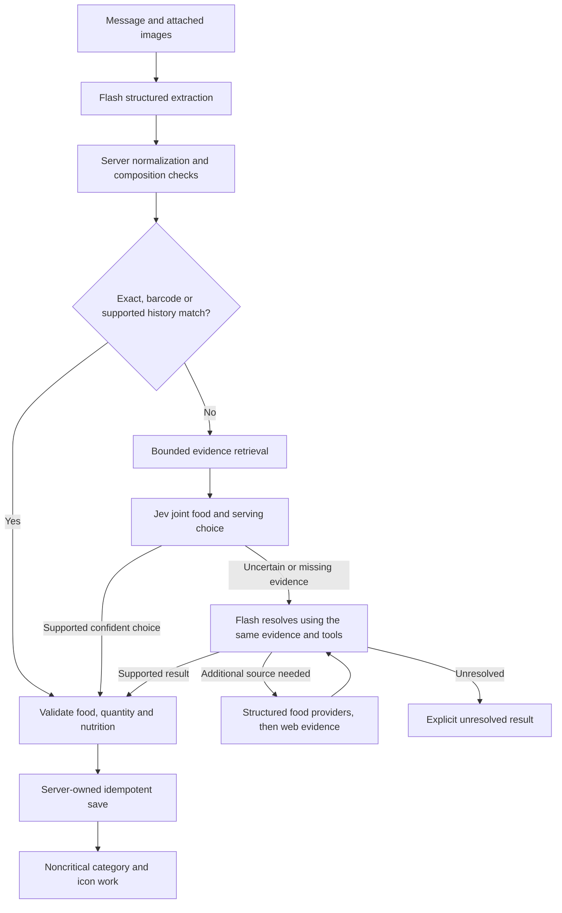

# Amino AI consolidation and code-removal plan

**Prepared:** 24 September 2026
**Status:** Historical implementation plan. See [the implementation status](./ai-model-implementation-status.md) for completed work, validation and open rollout gates. This plan alone does not authorize deployment.
**Basis:** [Model and pipeline audit](./ai-model-audit.md).

## Confirmed user decisions — 24 September 2026

- **Flash is the only general model for now.** Jev uncertainty may go to Flash. Flash failure gets bounded retries within the shared deadline, then an explicit unresolved result. Do not add a second general model or its fallback configuration in this cleanup.
- **Keep current vectors.** Preserve the active embedding model, preprocessing, stored vectors and indexes. A new embedding model or reindexing migration is outside this implementation scope.
- **Categorization and icons may finish after logging.** Save and report the validated food first; category/icon enrichment must not delay or fail that result. This records the user's response to the specific question about those two enrichment operations.
- **Use Jev for finite-choice categorization**, retaining quality, confidence and abstention checks before rollout. The user explicitly approved the taxonomy-only synthetic evaluation through OpenRouter; its results and remaining production checks are recorded in [the implementation status](./ai-model-implementation-status.md).
- **Use Exa through OpenRouter for the search migration.** Evaluate that integration against the Serper baseline before removing the old path. A standalone Exa integration is not the planned route.

## 1. Outcome and constraints

Make the normal product use **one general model (Gemini 3.8 Flash)** and **one decision model (Jev 1.13)**. Use a separate current image model because generating pixels is a different capability. Treat embeddings as a versioned data dependency. Prefer deleting old code over retaining wrappers, provider-specific variants, or a compatibility layer without an end date.

The user's priority is output speed and responsiveness. Do not replace Flash with Luna or Sol based on their model names, recency, or theoretical capability. GPT Sol is the implementation agent, not a requested Amino runtime model. The local six-request probe favors Flash but is not a production benchmark.

Keep these behaviors intact throughout the migration:

- Message ownership, claim/idempotency, editing semantics, queue redelivery, progress counts and correct terminal status.
- User-scoped history, explicit brand/preparation requirements, exact matches and barcode identity.
- Composition handling: dressings, oils, butter, branded milk and side components appear exactly once with the correct quantity.
- Catalogue revalidation, valid serving ownership and source-derived nutrition. Unknown macros remain unknown; model guesses do not become validated food facts.
- Typed nutrition constraints retain their current admission rules. A shadow classifier does not acquire write authority as a side effect of this cleanup.
- Existing icons and embeddings keep their meaning. Do not mass-regenerate icons or rewrite vector columns during a transport refactor.
- Historical benchmark outputs remain historical. Do not rewrite them to claim a new model produced the old results.

## 2. Proposed architecture



This is a target structure, not permission to remove today's recovery route before its coverage is replaced. Avoid a new “agent framework” around the existing Vercel AI SDK. Reuse `foodResolution/agent` contracts, bounded tools, validators and tests.

### Model roles

| Role | Proposed selection | Decision rule |
|---|---|---|
| Extraction, text and vision | `google/gemini-3.8-flash` through the evaluated route | One model for both modalities; retain separate schemas only where necessary. |
| Food and serving interpretation | Same Flash model | Supply already-fetched evidence and a small output contract. |
| Finite choices | `typesafe/jev-1.13` | Approved direction for categorization; evaluate and calibrate before rollout. Catalogue/serving selection already exists. |
| New icon | Candidate `gpt-image-2.5-flare` | Validate native PNG alpha, appearance, access and cost. |
| General-model recovery | Flash only | Bounded retries, then unresolved; no second general model in this cleanup. |
| Embeddings | Existing BGE base v1.5 and current vectors | User-confirmed compatibility exception; no embedding migration in this cleanup. |

Gemini's current documentation supports `low`, `medium` and `high` thinking for 3.8 Flash; `minimal` is unsupported. Use low as the initial comparison setting, with an evaluated output cap for each task. Do not assume `temperature: 0`, a zero thinking budget, or an older SDK's fields work unchanged. [Gemini 3.8 capabilities](https://ai.google.dev/gemini-api/docs/models/gemini-3.8-flash).

### One model policy, thin transports

Create one small policy module, e.g. proposed `src/ai/models.ts`. It should own approved model IDs, provider/endpoint, modality and structured-output/tool support, reasoning defaults, the date verified and explicitly permitted fallbacks. Business logic requests a task capability; it must not choose raw model strings.

Keep role names such as extraction, constraints and resolution for metrics and output budgets. They may all point to the same model. Do not create independent model environment variables for every small step.

The final policy has one general model, one decision model, one image model, and the selected search integration. Recovery uses Flash; remove independent general-model fallback configuration after its callers migrate. Keep the current embedding identity explicit and fixed to its compatible indexes.

During migration, read the existing `FOOD_REASONING_MODEL`, `FOOD_FALLBACK_MODEL`, `FOOD_SELECTOR_MODEL`, `FOOD_CONSTRAINT_MODEL` and `VERTEX_SERVING_MATCH_MODEL` through one resolver. Inventory actual deployed values before replacing them. Document precedence, reject unapproved/retired model values, and remove the aliases after the hosting configuration and callers are migrated. An obsolete override must not quietly revive GPT-3.5 or Haiku 3.

Use the existing Vercel AI SDK where it already covers the request contract. Keep Jev's Decisions API in a small reusable adapter; it is not a chat model. An image-only adapter can remain separate. Do not maintain parallel hand-written implementations of the same text JSON operation in OpenAI, Vertex, Gemini and OpenRouter modules.

## 3. Phase A — Capture the baseline and define the deletion boundary

**Purpose:** identify the paths to preserve and avoid using a green typecheck as evidence that a removed path was unused.

1. Record the starting commit and worktree status. This repository can be edited by other tasks; isolate the implementation if necessary and preserve concurrent serving-update work.
2. Read the audit, `FOOD_LIVE.md`, `FOOD_COMPOSITION.md`, `FOOD_CONSTRAINTS.md`, and `docs/plans/food-agent-migration.md`. Use them for supported behavior and historical results, not as a request to restart old phases.
3. Build an import/call inventory rooted in app routes, server actions, queues and supported maintenance commands. Distinguish unused imports, uncalled diagnostic functions, genuinely exported maintenance operations, and live code in `legacy/`.
4. Export the effective hosted model/feature settings without exposing keys. Compare them with source defaults and the audit's usage counts. Inspect Anthropic failed-request usage by key if access is available; do not claim the email is explained by the success-only database table.
5. Run the current local suite and TypeScript check. Save baseline failures before editing. No live food writes are required to discover dead code.
6. Create a compact approved-runtime manifest and a source check that rejects direct provider calls and runtime model IDs outside their agreed boundaries. Historical result files and explicitly opt-in comparisons need narrow exemptions, not a broad exclusion of all scripts.

**Exit:** every remaining live model call has a task, entry point, provider and owner; removal candidates have no necessary callers or a named replacement.

## 4. Phase B — Remove obsolete providers, variants and diagnostic code

**Purpose:** delete the most code while preserving current behavior. Do this separately from a quality-sensitive prompt rewrite.

### High-confidence removal candidates, after callers are removed

| Files or families | Why they can go / replacement condition |
|---|---|
| `languageModelProviders/anthropic/anthropicChatCompletion.ts` | Contains Claude 3 mappings, direct/Bedrock/Vertex failover and diagnostics. Migrate the bulk classifier first; remove dormant extraction/local-match callers. |
| `languageModelProviders/fireworks/{chatCompletionFireworks,fireworks}.ts` | Old Llama/Mixtral alternatives. Remove their dormant helpers and old provider-comparison scripts. |
| `languageModelProviders/groq/chatCompletionGroq.ts` | Old Llama transport and diagnostics; no current normal-path caller found. Verify repository consumers. |
| `languageModelProviders/vertex/chatCompletionVertex.ts` | Superseded text adapter; dormant streaming paths and test script remain. Current named “Vertex” serving aliases call the shared adapter, not this file. |
| `languageModelProviders/perplexity/perplexityChatCompletion.ts` and `missingFoodInfoOnlineQuery.ts` | Old Sonar wrapper/helper; remove unused imports and historical test references. |
| `localDbFoodMatch/matchFoodItemToLocalDbClaude.ts` and `...OpenAI.ts` | Old parallel implementations/fine-tunes; current path uses `...Llama.ts` through shared food completion. Retire obsolete comparison scripts. |
| `findBestServingMatchChat.ts` | Old fine-tuned serving path. Current worker uses the newer serving resolver. |
| `logFoodItemExtract/logFoodItemStreamFunction.ts` and `...Instruct.ts` | Old protocols. Current quick log uses JSON extraction. |
| `GenerateResponseForUser` in `RespondToMessage.ts`, `openai/legacy/ProcessFunctionCalls.ts` | Old conversation/function loop; no live caller found. Keep `GenerateResponseForQuickLog` and its current lifecycle. |
| Uncalled provider-specific functions inside extraction/time/classification modules | Multiple generators, JSON prefix tricks, diagnostics and model-specific branches survive in otherwise live modules. Remove by call graph. |
| `database/OpenAiFunctions/HandleLogFoodItems.ts` | Appears to contain only the earlier debug pipeline; verify consumers, then remove the duplicate insertion/matching code. |
| Most of `foodMessageProcessing/legacy/` | Delete obsolete completion/serving/debug paths after call-graph closure. **Do not delete the live external matcher or `assignDefaultServingAmount` until moved/replaced.** |
| `scripts/llm_testing/`, `scripts/test_anthropic/`, `scripts/test_vertex.ts`, old `test_food_matching` and `food_add_speed/extract_from_html.ts` | Replace executable old-provider experiments with current opt-in benchmarks where useful; git retains their historical source. |

The six obsolete provider-wrapper files total **2,129 lines** at the audited baseline. The retained OpenAI helper alone has 546 lines, and the category dictionary has 878, including repeated model-specific prompts. Do not set an arbitrary deletion quota; verify net production code decreases materially after required replacements.

### Consolidate and rename retained code

- Rename `matchFoodItemToLocalDbLlama` around its responsibility. It already invokes the shared food model. Update imports; remove aliases once actual callers are migrated.
- Rename serving `Gemini`/`Vertex`/`Llama` aliases to a task name after updating their callers.
- Move the live external matcher out of `legacy/` and replace its old protocol in Phase D.
- Move `assignDefaultServingAmount` to a shared serving utility and preserve its behavior.
- Replace model-keyed prompt dictionaries with one prompt and schema per task. Preserve the recent composition rules and useful examples. Remove obsolete variants and incorrect taxonomy examples.
- Remove uncalled `test*`/`benchmark*` functions, inline fake users/foods and commented provider switches from runtime files. Keep regression fixtures in tests and intentional offline evidence in results directories.
- Slim the generic OpenAI module to remaining real consumers, then remove it when the shared transport owns all calls. Do not retain “instruct” and “function_call” compatibility exports with no callers.

### Dependency and credential cleanup

After repository-wide consumer checks, remove the three Anthropic SDKs, `@google/genai` if its only remaining consumer was the retired Vertex adapter, and unused `@google-cloud/aiplatform`. Inspect Hugging Face separately; its import currently lives in the embedding module. Retain Deepgram until the mobile contract is audited.

Remove ClipDrop dependencies and configuration only after the icon change passes. `html-to-text` is removable only if the final search strategy no longer uses the scraper. Do not remove `gpt-tokenizer` until token-bounding consumers are handled; changing a usage estimator does not necessarily remove all consumers.

Update `package.json`, the lockfile, env documentation and deployment configuration together. Stop installing/initing unused clients at module import. Remove retired credential variables from the deployment only after successful rollout; revocation/account deletion requires its own explicit authorization.

**Exit:** no necessary code imports deleted providers; all supported routes and maintenance commands compile and run; no retired API is reachable through a forgotten script default.

## 5. Phase C — Centralize and validate Flash transports

1. Route text extraction, vision extraction, time interpretation, current food completion, missing-field completion, web import and classification fallback through the shared model policy.
2. Keep prompts/contracts stable in this phase. First prove equivalent structured-output handling before shortening prompts or combining stages.
3. Use current installed SDK capabilities only after a request-level smoke test. Check the actual wire payload: model, low reasoning, schema, image parts, output cap and abort signal. The old native GenAI adapter specifically worked around missing `thinkingLevel` serialization; do not reintroduce that bug.
4. Handle missing keys at invocation time. Optional web/image/alternate-provider configuration must not make unrelated route imports fail.
5. Give a request one cancellation/deadline context. Retries and provider recovery consume the remaining budget. Never restart a full 45-second timer at every layer.
6. Distinguish a provider outage from a semantic abstention. A transient outage may get a bounded Flash retry. Jev abstention may go to Flash with the same evidence. Flash abstention needs better evidence or an unresolved result; it must not select a different general model.
7. Reject partial JSON, refusals and length-truncated results before caching or saving. Validate arrays and nested fields with one real schema validator. Remove punctuation repair, assistant-prefilled braces and old function-call output shims after their consumers move.
8. Use provider token usage where available. Record estimated counts separately. Include model/route, stage, time to first content, completion duration, total duration, output/hidden tokens, finish reason, retries and recovery reason.
9. Revisit the application output cache: include full normalized input, model, prompt/schema version, relevant tool/evidence context and actual settings. Consider deleting the broad completion cache if hit-rate/latency data does not justify it. Never replay stale catalogue decisions without revalidation.

Remove obsolete OpenAI text recovery paths once their coverage is handled by Flash. Retain only independently needed image/embedding consumers; do not build a replacement OpenAI general-model fallback.

**Exit:** one reviewed Flash selection serves normal generative work, every caller has contract tests, and configuration cannot secretly fall back to GPT-4o mini or Haiku 3.

## 6. Phase D — Use Jev for finite choices and validate categorization

### Category classification

1. Convert the taxonomy into canonical data with unique IDs and explicit hierarchy. Fail the build on duplicates. Resolve `F-8-3` Celery/Tomatoes with a data migration plan: inspect stored ID/name pairs and affected references before renumbering; do not silently reinterpret old rows.
2. Remove the model-generated name from the persistence contract. Return a validated category ID/abstention; derive the name from the canonical taxonomy.
3. Build finite-choice decisions with meaningful category descriptions and a `none` option. The flat 404-option taxonomy exceeded Jev's 255-choice limit, so implementation uses a family decision followed by a family-scoped leaf decision. Never construct a dictionary from duplicate IDs or silently truncate the last categories.
4. Reuse the Jev transport while separating generic decision validation from food/serving-specific proposal validation. Do not manufacture fake food/serving proposals just to reuse `selectWithJev`'s current `SelectionTask` type.
5. Evaluate the full taxonomy, including dairy versus plant milk, whey versus other protein, whole nuts versus nut butters, mixed dishes, ambiguous products, infant-food categories and unfamiliar brands. Correct the hazelnut-butter teaching example.
6. Measure both accepted accuracy and abstention/coverage across confidence thresholds. Jev's confidence is not proof of correctness. Compare a flat decision with family-then-leaf only if flat selection has a demonstrated limitation.
7. Use Flash only for unresolved cases if its added accuracy justifies the latency. An uncategorized food must still be loggable. Route normal inserts and `scripts/classifyFoodItem` through the same classifier.
8. Cache only against normalized food identity plus taxonomy/policy/model versions. Do not recycle a category after the taxonomy meaning changes.

The user explicitly authorized taxonomy-only live evaluation with category labels and synthetic foods through OpenRouter, without user records. The final implementation passed four synthetic sets at a 0.9 confidence cutoff with 187 correct accepted categories and no wrong accepted categories; see [the implementation status](./ai-model-implementation-status.md). Keep abstention behavior and review real catalogue performance during a controlled rollout.

### External food candidate matching

This is also a closed-choice task, but incorrect choices affect nutrition rather than just organization.

Replace `legacy/matchFoodItemtoExternalDb.ts` with selection over the already-retrieved candidate set, reusing the existing identity policy for brands, cooking state, components and servings. Validate that the response points to a supplied candidate. Hydrate/revalidate the selected food before using its nutrition.

Start with current Jev + Flash recovery machinery if that reduces duplicate code. Do not add another obligatory model stage to an already resolved request. Measure top-candidate shortcuts against wrong-brand/preparation examples; the existing high-cosine acceptance path is not proof of semantic identity.

Remove the old `stop: "}"`, JSON repair, hand-written confidence field and GPT-4 function-call retry after the replacement passes. Preserve structured-database coverage.

**Exit:** one classifier for production and bulk work; no Haiku request path; no live GPT-3.5 instruct request; safe abstention and catalogue validation preserved.

## 7. Phase E — Collapse interpretation and recovery loops

This is the main architectural cleanup and should follow stable model transport tests.

- Prototype a single Flash extraction result containing food/components, explicit quantities, relevant time wording and typed nutrient claims. Include provenance/source spans. Normalize time and units deterministically using the user's timezone/reference time.
- Keep the known composition regression suite intact. Do not copy a meal's total calories or a base food's grams onto additions.
- Compare the merged extraction to today's parallel extraction/time calls. Keep separate calls if the larger contract hurts p95 or reliability. “One call” is a hypothesis, not an acceptance criterion by itself.
- Keep exact/barcode/history shortcuts. Keep deterministic serving scaling and nutrient calculation.
- Share candidate retrieval, catalogue hydration and history across Jev, Flash and recovery. A fallback should receive the evidence already paid for.
- Let one bounded Flash session retrieve additional evidence when needed. Remove separate “guess”, “retry another model”, “search again”, and “complete missing fields” steps where that session produces an equivalent validated result.
- Combine web import and missing-field completion around one evidence-backed food proposal contract. Avoid calling both on the same food when the first can identify all supported metadata.
- Move category/icon work off the meal's critical path, as approved by the user. Adapt the database/UI contract as needed to preserve a useful uncategorized or placeholder state. Report the validated food as logged without waiting for enrichment; retries must not create another food entry.
- Replace the old full pipeline fallback only after parity on supported quantities, external foods, images and constraint admission. Once parity is established, delete it instead of keeping both architectures indefinitely.

**Exit:** fewer serial model calls per resolved item, fewer repeated reads/searches, and one clear unresolved outcome under a shared deadline. Quality does not regress on quantities or composition.

## 8. Phase F — Replace Serper with Exa through OpenRouter after validation

### Selected integration

Use `openrouter:web_search` with explicit `engine: "exa"`. OpenRouter supplies the Exa key; a separate Exa credential is unnecessary. This beta server tool returns highlights rather than full page text, exposes citation annotations, and may run multiple searches. The older web plugin and `:online` variant are deprecated. [OpenRouter Exa server-tool documentation](https://openrouter.ai/docs/guides/features/server-tools/web-search#exa).

Proposed evaluation settings:

```json
{
  "tools": [{
    "type": "openrouter:web_search",
    "parameters": {
      "engine": "exa",
      "mode": "fast",
      "max_uses": 2,
      "max_results": 5,
      "max_total_results": 10,
      "max_characters": 4000
    }
  }],
  "max_tool_calls": 2
}
```

These are starting limits to evaluate, not measured optimal settings. Check that the installed SDK forwards the payload and preserves returned evidence; add a small transport boundary only if necessary. Verify account access and actual response handling with a synthetic no-write request before changing callers. Search belongs only on unresolved web-food work. Exact/database matches and taxonomy decisions should not pay for it.

Integrate search into the existing Flash evidence-resolution request. Keep server validation and writes in Amino. A final food proposal must have sufficient supporting evidence even when the model does not search. Measure PDF/table coverage and serving context before deleting the scraper: an excerpt may omit the units that make a nutrition number meaningful.

### Experiment

Create a reviewed set of 40–60 nutrition lookups covering exact UPC/branded items, restaurants with PDF menus, regional brands, common generic foods, units per serving/per 100 g, renamed products and deliberately insufficient evidence. Include some cases from existing local fixtures; sending private examples externally requires appropriate authorization.

Compare these strategies:

1. Current Serper plus HTML extraction, instrumented and with the ineffective text bound fixed in the evaluation branch.
2. Flash with the OpenRouter Exa server tool, beginning with the settings above. Compare a higher-recall configuration only if the fast configuration misses necessary evidence.

Do not build direct Exa and native-grounding adapters merely to expand the experiment. If the chosen integration has a demonstrated blocking limitation, document it before proposing a different route.

Measure correct product/serving identification, source authority, usable-content rate, source freshness, extraction accuracy, p50/p95 total latency, tokens fed to Flash, number of remote calls and cost per correctly resolved item. Search-result speed and provider marketing benchmarks are insufficient.

### Shared evidence contract

Represent each source with a stable ID, URL, title, retrieved-at time, provider, content/excerpts, and fetch/result status. The Flash result must identify which sources support calories, quantity basis and serving conversion. Preserve unknown values and distinguish estimation from sourced facts.

Validate returned URLs and fetches if Amino retains scraping: public HTTP(S) destinations, bounded redirects/size/time, no internal addresses, and robust HTTP/payload handling. Treat webpage content as data, not instructions. Domain deduplication must track all selected sources; PDFs need an explicit handling policy rather than accidental blanket exclusion.

### Migration gate

The planned destination is Exa through OpenRouter. Switch after source accuracy and end-to-end latency meet the baseline gates. If it fails, record the concrete failures and retain the existing path until resolved; do not silently trade correct nutrition for fewer lines of code.

After the gate passes, remove Serper and any now-unused scraping/HTML-conversion code and configuration. Do not retain a permanent dual-search fallback by default. Preserve supported structured nutrition database lookups.

**Exit:** the chosen search path has preserved citations and bounded content, no import-time credential failure, no silent unbounded text, and a documented evidence/latency win.

## 9. Phase G — Modern icons; preserve vectors and audit speech separately

### Icons

Replace DALL·E 3 with the evaluated current image model. Request transparent PNG bytes directly; verify the returned payload is an image, preserve alpha and upload through the existing storage/linking flow. Keep icon reuse/deduplication and noncritical queue behavior. Validate five representative foods visually: beverage/container, simple produce, mixed meal, pale food and detailed packaged-style food. No bulk regeneration.

After success, delete the intermediate URL download, ClipDrop request, related imports and configuration. Bound generation time and make retries idempotent with respect to creating/linking icon records. Log actual image usage/cost separately from text estimates.

### Embeddings

The user explicitly chose to keep current vectors. This cleanup must preserve the active model, query preprocessing, dimensions, caches, stored vectors and indexes. Record the current embedding identity in the central inventory without making it a freely swappable configuration value.

Inventory BGE/ADA consumers and remove provably unused experiments or helper branches, preserving active retrieval behavior and all stored vectors. Do not backfill, add replacement indexes, drop vector columns, change embedding hosts/preprocessing, or benchmark a replacement model as part of this scope. A later embedding migration would need its own request and versioned reindexing plan.

### Speech

Inspect the mobile client's Deepgram model, streaming mode, language, endpointing and latency separately. The server credential route must continue working meanwhile. Do not report speech “centralized” based solely on changing a server constant that the client does not use.

## 10. Validation and release gates

### Functional and negative tests

Use the existing `tests/food-*.test.cjs` suites as behavior contracts. Add meaningful tests for changed boundaries, not one test per deleted helper.

| Area | Required coverage |
|---|---|
| Policy/transport | Unknown or retired IDs rejected before network access; correct keys/endpoint per route; structured schema and image handling; timeout propagation; no invisible model switch. |
| Extraction | Explicit additions and branded components, foods with unknown quantities, actual image fixtures, complete/refused/truncated JSON, no partial result cached as successful. |
| Jev | Duplicate taxonomy rejection, every choice maps to a canonical ID, no invented category/food/serving, low-confidence/unknown abstention, taxonomy version invalidates cache. |
| Matching | Exact/history/barcode shortcuts, full identity, source-derived nutrition, serving ownership, explicit grams, preparation/brand mismatch, no phantom defaults. |
| Search | Missing credentials, non-2xx/malformed responses, empty results, duplicate domains, oversized content, failing URLs, PDFs, citation/source retention. |
| Lifecycle | Ownership, edits, duplicate queue delivery, counts published before workers complete, failure/partial status, icons/category failure independent of food success. |
| Embeddings | Query/index version agreement and retrieval parity; no model change behind the old cache key. |

### Real performance benchmark

Use actual production prompts/schemas and synthetic or authorized representative inputs. Test short and long outputs and text/photo/label cases. Run at least 30 requests per important stratum; repeat runs with enough samples before relying on p95. Interleave providers, record warm/cold connections and provider caches, and control concurrency.

Measure:

- Time to first content, full generation time and time to the first **usable validated food result**.
- Visible output tokens per second, with the token-counting method documented; distinguish provider tokenizers from a common tokenizer. Exclude hidden reasoning and record it separately.
- Completion length and output correctness. A model that omits a dressing can look faster while doing less work.
- End-to-end resolved-food p50/p95 and total provider/database calls, including every recovery attempt.
- Match accuracy, quantity accuracy, component omissions/duplication, source-backed nutrition, abstention rate and cost per successful resolution.

Suggested acceptance policy: no regression on the curated correctness gates; retired model calls fall to zero; output speed and end-to-end latency meet or improve the measured baseline for the supported route. Set numerical budgets from that baseline rather than treating the audit's three short trials as an SLA. Report exceptions by input class.

### Release sequence

Keep deletion/transport changes reviewable independently from merged extraction and search changes. Run the appropriate suites and TypeScript after each coherent phase; run a production build before rollout. Any live smoke should use synthetic records with tracked cleanup or a no-write endpoint.

Model/schema changes need an explicit deployment/config update, and effective nonsecret policy should be visible in startup diagnostics. Validate the deployed artifact uses the new policy. Roll back by promoting the previous known deployment rather than leaving every old provider permanently in the new codebase.

No deployment is part of this audit task. A later implementation task must follow the user's authorization for publishing.

## 11. Definition of done for the later implementation

- Normal text/vision/reasoning requests use the shared Flash model, and supported finite choices use the one evaluated Jev policy.
- No production route or supported maintenance command can request Haiku 3, old GPT fine-tunes, GPT-3.5 instruct, DALL·E 3, or an unapproved fallback.
- Old provider adapters, unreachable experiments, duplicate pipelines/prompts and no-longer-used dependencies are removed, with a reviewed net code reduction.
- One canonical taxonomy is valid; duplicate stored IDs have an explicit handling/migration decision; category names are derived server-side.
- The live external matcher has been replaced before its legacy implementation is deleted.
- Search uses the validated OpenRouter Exa integration, with source provenance and bounded work; Serper and obsolete scraping code are removed after the gate passes. Any unmet gate is reported explicitly as remaining work.
- Icons no longer require a second background-removal service if the native-alpha trial succeeds.
- Current embedding behavior and stored vectors remain intact as the user-approved compatibility exception. No vector migration is included.
- Speech is audited in the client before being claimed complete across Amino.
- Tests, build, synthetic validation, performance and residual limitations are recorded. Historical benchmark numbers are not presented as new-model evidence.

## 12. Handoff prompt for GPT Sol

> Implement Amino's AI consolidation plan from the current repository state. Read `ai-model-audit.md` and this plan, including the confirmed user decisions. Use Flash as the only general model, Jev for finite choices, and Exa through OpenRouter for web search after the source/latency gate passes. Preserve the current embedding model and vectors; no reindexing migration. Category and icon enrichment may finish after the validated food is logged. The user approved evaluating Jev with the internal category labels and synthetic food names through the existing OpenRouter account, without user records. Preserve recent Jev/Gemini matching, composition fixes, deterministic nutrition, queue/idempotency behavior and unrelated concurrent changes. Trace the live external matcher before deleting legacy code. Centralize approved model selection and remove unused providers, duplicated pipelines and dependencies. Do not introduce another general model or build a standalone Exa integration. Validate actual task outputs, source accuracy and latency before rollout. Report completed phases, measurements, net deletions and remaining work. Deployment requires the user's applicable authorization.
