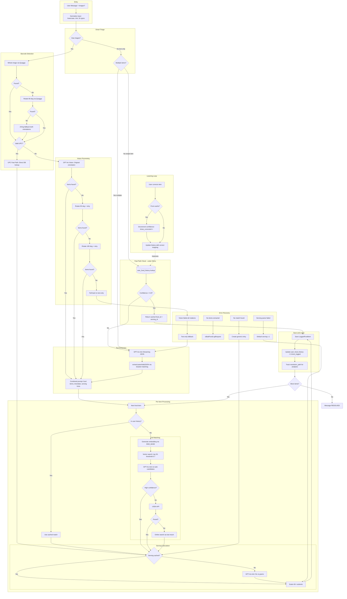

# Food Logging LLM Pipeline - Optimized Design

## Complete System Diagram



---

## Speed Comparison

| Path | Steps | Latency | When Used |
|------|-------|---------|-----------|
| History Fast Path | 1 DB lookup | ~50ms | Repeat foods, high confidence |
| UPC Fast Path | Barcode + 1 DB lookup | ~200ms | Valid barcode detected |
| Item History | Per-item DB lookup | ~50ms/item | Known items in multi-food message |
| Serving Cache | 1 DB lookup | ~20ms | Same food+serving combo |
| Full Text Path | LLM + Match + Serve | ~3-5s | New foods, text only |
| Full Vision Path | Barcode + Vision + Match | ~5-8s | New foods with images |
| Vision + Rotation | Up to 3 vision calls | ~10-15s | Difficult images |

---

## Fast Path Coverage Over Time

```
Week 1:   ####................ 20% fast path
Week 2:   ########............ 40% fast path
Week 4:   ############........ 60% fast path
Week 8:   ################.... 80% fast path
Week 12+: #################### 85%+ fast path
```

---

## All Edge Cases Handled

| Edge Case | Handling | Fast Path? |
|-----------|----------|------------|
| Rotated food photo | Try 0 -> 90 -> 180 -> text fallback | No |
| Barcode anywhere in image | Quagga -> ZXing, both orientations | UPC lookup |
| UPC-A vs EAN-13 leading zeros | Normalize before lookup | Yes |
| Streaming partial JSON | Bracket-counting parser | N/A |
| My usual coffee | Normalize + history lookup | Yes |
| Multiple items in one message | Per-item history check | Per item |
| Explicit nutrition like 200 kcal | LLM extraction, cannot skip | No |
| Unusual serving like half a handful | LLM serving estimation | No |
| No match in any database | Create generic entry | No |
| User corrects wrong match | Update history, decay confidence | Learns |
| Old preferences over 90 days | Confidence decay via cron | Auto-clean |
| New user with no history | Full path, builds history | Builds over time |
| Image completely unusable | Fall back to text extraction | Degrades gracefully |

---

## LLM Calls: Before vs After

| Scenario | Before | After with history |
|----------|--------|----------------------|
| banana 10th time | 3 LLM calls | 0 LLM calls |
| 2 eggs, toast, coffee usual breakfast | 9+ LLM calls | 0 LLM calls |
| Photo of Starbucks cup with barcode | 1 vision + 2 LLM | 0 LLM calls |
| New food, text only | 3 LLM calls | 3 LLM calls then cached |
| New food, with image | 1 vision + 2 LLM | 1 vision + 2 LLM then cached |

**Expected savings: 70-85% reduction in LLM costs for active users**

---

## LLM Provider Consolidation

| Task | Before | After |
|------|--------|-------|
| Time extraction | Claude Haiku | Merged into food extraction |
| Food extraction text | GPT-4o-mini | GPT-4o-mini unchanged |
| Food extraction images | GPT-4o | GPT-4o unchanged |
| Food matching re-rank | Various | GPT-4o-mini |
| Serving estimation | Gemini 1.5 Pro | GPT-4o-mini |

**Providers reduced from 4 to 1 (OpenAI only)**

---

## Database Schema Addition

```sql
CREATE TABLE user_food_history (
    id                  UUID PRIMARY KEY,
    user_id             UUID NOT NULL REFERENCES users(id),

    -- Matching keys
    normalized_input    TEXT NOT NULL,
    input_variants      TEXT[],
    upc_code            TEXT,

    -- Cached result
    food_item_id        UUID REFERENCES food_items(id),
    serving_id          UUID REFERENCES servings(id),
    default_amount      DECIMAL,

    -- Confidence signals
    times_logged        INT DEFAULT 1,
    times_confirmed     INT DEFAULT 0,
    times_corrected     INT DEFAULT 0,
    confidence_score    DECIMAL GENERATED ALWAYS AS (
        (times_confirmed::decimal - times_corrected * 2) / NULLIF(times_logged, 0)
    ) STORED,

    -- Context
    last_logged_at      TIMESTAMP,
    created_at          TIMESTAMP DEFAULT NOW(),

    UNIQUE(user_id, normalized_input),
    INDEX(user_id, confidence_score DESC)
);

-- Track resolution path for analytics
ALTER TABLE logged_food_items ADD COLUMN resolution_path TEXT;
-- Values: fast_history, upc_lookup, vector_match, llm_rank, usda, online, manual
```

---

## Key Optimizations Summary

1. **User food history** - Skip entire pipeline for repeat foods
2. **UPC fast path** - Barcode goes straight to DB lookup
3. **Per-item history check** - Even in multi-item messages, known items skip matching
4. **Serving cache** - Same food + serving combo is instant
5. **Merged time extraction** - One LLM call instead of two parallel
6. **Provider consolidation** - Single provider simplifies ops
7. **Learning loop** - System improves with every correction
