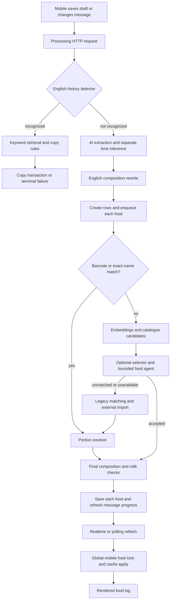

# Amino food pipeline architecture audit

Audit date: September 24, 2026. Scope: food input, interpretation, history, retrieval, food/portion resolution, persistence, edit/retry behavior, and mobile delivery/display. This is an audit and replacement design, not a deployment or another set of food-specific patches.

## Conclusion and accountability

The smoothie code is not an isolated mistake. The recent implementation put an English rules engine around an AI pipeline, then gave those rules authority to rewrite or reject the model's interpretation. The agent is a bounded per-food selector, not a meal-resolution agent. It cannot express the history-reference, composition, quantity, and edit operations the product needs.

I introduced and deployed the smoothie special case in `b09e3c5`, and enabled the history reuse path. That was the wrong fix. The broader recent work also added restrictive portion validators, composition rewrites, and milk-specific checks. The right correction is to replace their semantic authority with an agent that can fetch evidence and produce a structured meal plan. Adding translations or more regex branches would preserve the underlying problem.

Several inherited bugs also remain in paths that the new agent falls back to. They matter because the recent work retained those paths as the recovery strategy. Commit history below distinguishes inherited defects, recent changes, and separate undeployed work; it does not infer authorship from a Git display name.

## Source snapshots and verification

- Production: Vercel inspection during this audit returned `READY` for `amino-1ynae2i7f-hedge.vercel.app`, with `www.amino.fit` among its aliases. This is the deployment previously verified for `b09e3c5f927007983ebca94d97b30eb44e0ff1e2`. The clean isolated checkout at `/private/tmp/amino-smoothie-server` is exactly that commit. A separate commit-filtered deployment-list request failed with a network error; it did not change anything.
- Local server: HEAD `1a957f3`, including the separate `981291c` model cleanup, plus the uncommitted equivalents of the history hotfix. This is materially different from production, particularly extraction, external search, and model providers.
- Mobile: current working tree, including the uncommitted latency/edit/sync work. I did not verify its complete correspondence to the currently installed iPhone binary. Installation remains deferred as requested.
- Ran actual TypeScript functions offline against both server snapshots, with provider/database boundaries stubbed. There are **25 characterization observations on the deployed source** and **28 on local source**, including the mobile lock probe. These reproduce code behavior; they are not live multilingual model evaluations or production latency measurements.
- No runtime source, production configuration, database records, or phone installation changed during this audit. Added this report, an offline probe, and its JSON evidence.

Reproduce from the server directory:

```sh
node scripts/food-baseline/audit-pipeline.cjs
node scripts/food-baseline/audit-pipeline.cjs /private/tmp/amino-smoothie-server
```

Evidence: [probe](/Users/seb/Documents/GitHub/amino-server/scripts/food-baseline/audit-pipeline.cjs), [deployed-source results](/Users/seb/Documents/GitHub/amino-server/pipeline-audit-evidence/deployed-b09e3c5-2026-09-24.json), [local-source results](/Users/seb/Documents/GitHub/amino-server/pipeline-audit-evidence/local-2026-09-24.json).

## Actual control flow



Image/barcode and exact-name routes bypass the live agent. History reuse also bypasses it. An agent failure can therefore lead to a different interpretation policy, not just another attempt at the same contract.

## Findings

Priority P1 means fix before claiming multilingual agent-led resolution or broadly rolling out the replacement. P2 means a significant consistency, latency, or maintainability issue. Findings marked conditional require checking product policy or production data; they are not claims of observed exploitation or measured user harm.

### 1. P1 — History language and referent scope are implemented in code

**Production; recent work, extended by my deployed patch.** [reuse.ts:14](/Users/seb/Documents/GitHub/amino-server/src/foodResolution/history/reuse.ts:14), [search.ts:26](/Users/seb/Documents/GitHub/amino-server/src/foodResolution/history/search.ts:26).

`isHistoryReference` recognizes English `same`, `usual`, and a meal list. `referenceTarget` accepts essentially `same X as/from yesterday`. Modifications, other dates, and most ordinary paraphrases are refused. Recognized-but-unsupported requests return failure before the agent gets a chance. Non-English references miss this branch entirely.

Retrieval adds English stop words, plural stripping, a special `smoothie` test, fixed breakfast/lunch/dinner hours, and all-term text matching. The final copy uses a list of whole-meal words plus my smoothie exception to decide whether to copy a group or selected foods. A different dish requires another code exception under this design.

**Reproduced:** `same smoothie as yesterday` is accepted by the grammar; `same smoothie as yesterday without honey` and `my usual breakfast` are intercepted but unsupported. French, Spanish, and Chinese equivalents are not recognized. A 100-event scan and five-candidate result are not inherently wrong, but the agent cannot page through them or examine an excluded event.

**Replace:** let the agent interpret the reference/date/scope and fetch the user's events with their original text, structured foods, and provenance. It selects source event/food IDs and requested transformations. The backend validates ownership, versions, selected IDs, and arithmetic. The user's intent that the smoothie includes its component foods should follow from the event structure and context, not the word `smoothie`.

### 2. P1 — The agent's contract prevents the intended product behavior

**Production when live selector is enabled; recent work.** [resolve.ts:8](/Users/seb/Documents/GitHub/amino-server/src/foodResolution/agent/resolve.ts:8), [types.ts](/Users/seb/Documents/GitHub/amino-server/src/foodResolution/agent/types.ts), [evidence.ts:54](/Users/seb/Documents/GitHub/amino-server/src/foodResolution/agent/evidence.ts:54).

The proposal contains only `decision`, `foodId`, and `servingId`. It cannot express quantity, a copied meal, component groups, substitutions, omissions, nutrient scope, or a clarification. The prompt explicitly declares meal references and vague portions unmatched. The history tool returns ranking hints and omits original event text; the model does not have enough context or output capability to resolve whole-meal references.

Three steps, six retrievals, and 12 seconds are enforced over prefetched catalogue/history plus optional further searches. Budgets are useful, but here they cap a selector whose tools cannot perform the requested task. There is no agent tool for inspecting external food sources or retrieving a complete historical event by ID.

**Replace:** a meal-level resolver with evidence-fetching tools and a typed plan. Keep bounded execution, but budget by task complexity and provide explicit `needs_clarification`, `retryable_error`, and `resolved` outcomes. Allow the agent to fetch foods, servings, historical meals, and source evidence as needed.

### 3. P1 — English portion grammar overrides valid agent reasoning

**Production live path; recent work.** [validate.ts:9](/Users/seb/Documents/GitHub/amino-server/src/foodResolution/agent/validate.ts:9), [selection.ts:23](/Users/seb/Documents/GitHub/amino-server/src/foodResolution/agent/selection.ts:23).

The agent's grams are reconstructed from a small English grammar. Allowed units include cup/tsp/tbsp and individual food words such as egg/apple/banana; bowl is absent. Serving labels must be bare words or simple integer-prefixed words. `regular`, `without`, and other words cause automatic rejection. The fast selector runs this validator before constructing its choices, so the AI never even sees excluded food/serving options.

**Reproduced:** `two cups rice` works; `1/2 cup rice` fails while `half a cup rice` works. `one bowl rice` fails despite an authoritative bowl weight. `one cup regular rice` fails. French, Spanish, and Chinese portion text fails at this boundary.

Extraction currently asks for English translation, so these boundary probes do not prove that every non-English end-to-end request fails. They prove that translation is being used as an implicit parser protocol, with no structured quantity contract or retained distinction between original and inferred facts.

**Replace:** AI emits quantity and canonical unit/serving references with supporting evidence. Code validates finite values, unit dimensions, serving ownership, and the resulting computation. It must not re-interpret the sentence to decide whether the model was allowed to mean “bowl.”

### 4. P1 — Composition and product identity are rewritten by an expanding keyword engine

**Production, including final worker checks; recent work.** [composition.ts:5](/Users/seb/Documents/GitHub/amino-server/src/foodResolution/composition.ts:5), [RespondToMessage.ts:85](/Users/seb/Documents/GitHub/amino-server/src/foodMessageProcessing/RespondToMessage.ts:85), [processAndMatchLoggedFoodItem.ts:92](/Users/seb/Documents/GitHub/amino-server/src/foodMessageProcessing/processAndMatchLoggedFoodItem.ts:92).

The code contains lists of additions and base foods, connector spellings including `woth`, packaged-product exclusions, English negation, brand-location rules, vinaigrette-as-oil rules, milk percentages, and quantity-suffix parsing. `preserveExplicitAdditions` changes the model's decomposition. Name-based coverage and milk checks can subsequently veto exact, agent, and legacy matches.

**Reproduced:** `chicken with butter` is split and a plain chicken candidate vetoed; equivalent French text is neither split nor checked. More fundamentally, a name containing `oil` does not establish which oil or whether it represents the intended complete preparation. Ingredient and identity evidence belong in semantic resolution, not display-name substring tests.

**Replace:** model-owned component grouping, brand/preparation attributes, and evidence-backed ingredient coverage. Keep generic checks for missing plan components, duplicate source IDs, and arithmetic. Remove the semantic rewrite and veto modules once the unified resolver owns their behavior; do not simply delete them while leaving the old unsupported pipeline in charge.

### 5. P1 — Newly added ASCII “exact matching” can select an unrelated non-Latin food

**Local model cleanup only; not in deployed b09e3c5.** [local matcher:6](/Users/seb/Documents/GitHub/amino-server/src/foodMessageProcessing/localDbFoodMatch/matchFoodItemToLocalDb.ts:6), [external selector:6](/Users/seb/Documents/GitHub/amino-server/src/foodMessageProcessing/common/selectExternalFood.ts:6).

Both normalize names by removing everything except `a-z0-9`, then return the first equal candidate without a model call. Distinct non-Latin names can both become the empty string. Brand names can lose their identity for the same reason.

**Reproduced in both functions:** request `米饭` (rice), candidate `寿司` (sushi) → sushi returned as an exact match. This is an unconditional shortcut whenever these inputs reach the functions; live extraction frequency was not measured.

**Release blocker:** identity shortcuts must operate on established catalogue IDs or semantically confirmed structured identity. Unicode-preserving normalization and nonempty checks are necessary input hygiene but do not, by themselves, establish semantic equivalence.

### 6. P1 — Edit persistence is not a single revisioned operation

**Production server plus current mobile; retained through recent changes.** [mobile edit:332](/Users/seb/Documents/GitHub/amino-mobile/common/dbReadWrite/sendAndWriteToDb.ts:332), [server edit:56](/Users/seb/Documents/GitHub/amino-server/src/foodMessageProcessing/RespondToMessage.ts:56), [history refusal:86](/Users/seb/Documents/GitHub/amino-server/src/foodResolution/history/reuse.ts:86).

Mobile writes the new text/time to Supabase and its local cache before asking the processing endpoint to resolve that edit. An ordinary edit then soft-deletes the existing food rows before extraction succeeds. Failure can leave the meal without its previous visible foods. My history transaction preserves/replaces foods atomically, but a rejected history edit keeps old foods while the message has already changed. Returning `FAILED` while retaining an older resolved database lifecycle also creates divergent response and stored state.

There is no persisted edit revision or idempotent operation result tying text, foods, and response together. App-local locks cannot coordinate another device. The message claim does prevent some duplicate work, but it is not an end-to-end edit transaction.

**Replace:** create a pending revision containing proposed content/time/images; resolve into staged foods; atomically publish the new text and food set only when that revision succeeds. Preserve the last successful revision on failure. Return/query a durable operation ID. The history RPC's transaction, ownership, and source-version checks are useful building blocks to generalize.

### 7. P1 — Queue work lacks a claim and final revision fence

**Production; existing design retained.** [queue handler:36](/Users/seb/Documents/GitHub/amino-server/src/app/api/queues/process-food-item/process-food-item.ts:36), [worker:50](/Users/seb/Documents/GitHub/amino-server/src/foodMessageProcessing/processAndMatchLoggedFoodItem.ts:50), [update helper:5](/Users/seb/Documents/GitHub/amino-server/src/foodMessageProcessing/common/updateLoggedFoodItemData.ts:5).

The queue reads `Needs Processing` but does not atomically claim the row. Two overlapping deliveries can both enter expensive matching. Final updates filter by food-row ID only, with no expected revision/status/deletedAt check. If state changes while the model is running, the worker can still write stale results or a failure after a competing success. A deleted row is not automatically resurrected by this update, but it can still be modified and trigger unnecessary follow-on work.

Insertion of pending rows and queue enqueue are separate operations. An interrupted request between them can leave `Needs Processing` rows without a guaranteed durable dispatch.

**Replace:** operation/revision IDs, atomic worker claims or leases, compare-and-set publication, and a transactional outbox or equivalent durable dispatch. Test duplicate delivery, crash after insert, lost acknowledgement, delete during processing, and edit from a second device. These are concurrency findings from source inspection, not reproduced production incidents.

### 8. P1 — Fallback portion conversion can corrupt serving identity

**Production and local; inherited from 2024.** [converter:199](/Users/seb/Documents/GitHub/amino-server/src/foodMessageProcessing/getServingSizeFromFoodItem/getServingSizeFromFoodItem.ts:199).

After the model chooses a serving, code sorts all servings by grams per unit and substitutes the first whose weight divides the total grams into an integer. The 1% comparison is effectively self-confirming because `userUnits` was just calculated from the same total. It does not establish the user's unit.

**Reproduced:** a model selects one 100 g cup. The catalogue also contains a 5 g teaspoon. The converter saves the teaspoon ID while retaining amount `1`, unit `cup`, and grams `100`. A second probe shows an unknown model serving ID survives remapping. The worker does not validate that fallback serving IDs belong to the matched food before assigning them. A database FK can reject a nonexistent ID; it does not by itself reject an existing ID from another food.

**Replace:** one typed portion calculation shared by every route, with explicit serving ownership and a consistent quantity/unit/grams tuple. Never replace a chosen serving based on divisibility. Avoid unconstrained expression evaluation as the model output contract; use typed operands and supported arithmetic.

### 9. P1 — Nutrition constraints have no coherent live semantics

**Production; inherited numeric merge plus recent routing restrictions.** [worker:108](/Users/seb/Documents/GitHub/amino-server/src/foodMessageProcessing/processAndMatchLoggedFoodItem.ts:108), [selection.ts:13](/Users/seb/Documents/GitHub/amino-server/src/foodResolution/agent/selection.ts:13), [constraints contract](/Users/seb/Documents/GitHub/amino-server/src/foodResolution/constraints/contract.ts).

Any supplied nutrition sends the live agent to the old path. The worker preserves provided nutrients only if all four primary values are present; otherwise catalogue computation replaces the primary values, including a supplied calorie/protein value. For example, a user-provided protein fact has no reliable distinction between a label constraint, a consumed amount, or a whole-meal target. The serving prompt appends target calories but has no equivalent typed treatment for other nutrients.

The newer constraint contract correctly introduces scope/basis concepts, but is shadow-only and then validates interpretation through English regexes. **Reproduced:** `20 g protein` is recognized; French, Spanish, and Chinese equivalents are not. It also requires positive values, so explicit zero-valued label facts are outside that schema. Do not promote this shadow implementation as the solution.

**Replace:** retain each fact with original evidence, nutrient, basis, relation, and component/group scope in the meal plan. Let AI interpret meaning; let arithmetic check consistency and solve supported quantities. Explicit user facts must not silently disappear. Keep unknown nutrients distinct from zero.

### 10. P2 — Fast and fallback paths disagree about identity and valid input

**Production; recent shortcuts plus inherited fallback.** [exact lookup](/Users/seb/Documents/GitHub/amino-server/src/foodMessageProcessing/findExactLocalFood.ts), [live reconstruction:52](/Users/seb/Documents/GitHub/amino-server/src/foodResolution/agent/live.ts:52).

**Reproduced:** an extracted search name `rice`, description `100 g cooked rice`, and catalogue item `rice` passes the exact shortcut, although the agent validator requires a cooked-state label. This is a disagreement between branches; it does not prove that every such rice candidate is nutritionally wrong.

**Reproduced:** `100 g 2% milk` is accepted by the agent validator after removing the fat percentage from quantity parsing, then rejected by live result reconstruction, which parses the unmodified text. It falls through to the slower resolver despite a valid result.

More generally, the agent forbids estimated portions but the legacy serving prompt explicitly requests estimates/default portions. An agent abstention or timeout may therefore produce a more permissive result through another route. An optional second-best food is also hydrated/imported before the primary result returns, creating latency and failure coupling to an unused alternative.

**Replace:** one semantic plan and one publish validator for fast, agent, image, barcode, and fallback routes. Fast paths should reuse verified facts. Fallback should fetch different evidence or use another model under the same contract, not weaken the interpretation policy.

### 11. P1 conditional — Catalogue access boundaries and metadata need explicit policy

**Production and local; older search plus newer evidence tools.** [agent evidence:15](/Users/seb/Documents/GitHub/amino-server/src/foodResolution/agent/evidence.ts:15), [search API:90](/Users/seb/Documents/GitHub/amino-server/src/app/api/search-food/route.ts:90), [cosine SQL](/Users/seb/Documents/GitHub/amino-server/supabase/migrations/20240327200248_get_cosine_results.sql).

History retrieval is user-scoped, which is correct. Catalogue lookup uses an admin client without a visibility/owner predicate. The checked-in cosine function has no owner filter. The mobile search response includes `userId` and `messageId`, and food import stores an originating message ID. If any catalogue entries are private/user-specific, the tool boundary is insufficient; even shared foods should not expose another user's message metadata unnecessarily.

This audit establishes missing predicates/projections in source, not a demonstrated cross-user data leak. The live catalogue visibility policy and current database functions/RLS require verification before expanding agent tools. Treat shared catalogue evidence and private meal history as separate capabilities, with identity supplied by the authenticated server context.

### 12. P2 — Retrieval errors become “no food,” and multilingual retrieval is not a contract

**Production and local.** [embedding retrieval:32](/Users/seb/Documents/GitHub/amino-server/src/foodMessageProcessing/getBestFoodEmbeddingMatches/getBestFoodEmbeddingMatches.ts:32), [agent search:31](/Users/seb/Documents/GitHub/amino-server/src/foodResolution/agent/evidence.ts:31), [embedding provider](/Users/seb/Documents/GitHub/amino-server/src/utils/embeddingsCache/getCachedOrFetchEmbeddings.ts).

**Reproduced:** all four embedding RPCs return database errors, yet the function returns an ordinary empty candidate list. Downstream code can interpret a temporary outage as absence and initiate external search/import.

Agent catalogue search is an AND of name substrings, limited to the first 12 IDs; aliases and semantic retrieval are not available through that tool. The agent can try another query, but cannot page or broaden a structured search. BGE calls use the explicitly named `bge-base-en-v1.5` model; full-message embeddings and mobile manual search are not preceded by the extractor's English translation. No multilingual retrieval benchmark was run here, so this is an unevaluated dependency, not a quantified recall claim.

**Replace:** typed empty/error/truncated results, multilingual/alias-aware retrieval, and inspectable/paged candidates. Text search is useful as a retrieval tool; it should not decide what a user means or whether a meal reference is valid.

### 13. P2 — Remaining latency comes from orchestration, not only model speed

**Current mobile plus production request/worker architecture.** [edit lock:335](/Users/seb/Documents/GitHub/amino-mobile/common/dbReadWrite/sendAndWriteToDb.ts:335), [global lock](/Users/seb/Documents/GitHub/amino-mobile/common/dbReadWrite/foodDataLock.ts), [sync queue:48](/Users/seb/Documents/GitHub/amino-mobile/watermelon/syncLoggedFoodItem.ts:48), [request finally:119](/Users/seb/Documents/GitHub/amino-server/src/foodMessageProcessing/RespondToMessage.ts:119).

- Text edits hold the single food-data lock through network readiness checks, text updates, and the processing HTTP request. Realtime refetch/cache application uses the same lock. **Reproduced:** an unrelated sync cannot proceed while an edit owns it.
- The edit and portion POST calls have no explicit client deadline. The editor disables closing while awaiting them. A slow/hung request can appear as an indefinitely stuck Save button.
- The sync queue prioritizes pending food jobs but cannot preempt an active date/range refresh. Errors retry under the same global scheduling structure. Two-second polling helps missed events, but cannot escape the shared lock.
- The server waits for separate time inference before enqueueing foods and awaits history/nutrition shadow work in `finally` before returning. Nutrition shadow has an eight-second budget. Shadow work may therefore delay an edit acknowledgement despite not changing the saved result.
- Per-food processing can spend time in agent prefetch/selection, then enter the entire legacy retrieval/serving pipeline. Work on the unused second-best candidate can block the selected result.

These mechanisms can explain server/app divergence, but this audit does not attribute a specific 30-second incident without correlated timestamps.

**Replace:** immediate durable operation acceptance; per-meal pending state; background resolution; version-aware cache application with short local transactions rather than locks spanning network calls; priority refreshes; explicit request deadlines and queryable uncertain outcomes. Keep polling as reconciliation. Run optional diagnostics outside user acknowledgement and publication paths.

### 14. P2 — Source provenance, time, images, and voice remain fragmented

**Mixed production and local; details vary by snapshot.**

- Deployed online nutrition uses a separate search/model pipeline and does not persist structured per-value source evidence. The undeployed replacement requires a cited URL, but URL membership alone is not proof that every weight/nutrient/variant is supported by that page. Its own [implementation status](/Users/seb/Documents/GitHub/amino-server/ai-model-implementation-status.md) records an unsuccessful search-quality gate (21/40 accepted, including secondary sources). That is pre-existing evaluation evidence, not a rerun in this audit. Do not deploy the whole local cleanup merely to fix history.
- Date interpretation uses a separate model call anchored to the current server time, while history reuse uses selected consumption time and worker history uses message creation time. Delayed delivery, edits, and “yesterday” as a reference versus consumption date need one explicit temporal context. See [time inference](/Users/seb/Documents/GitHub/amino-server/src/foodMessageProcessing/messageTime/extractMessageTime.ts).
- Image extraction produces the same weak per-item strings and bypasses the live agent downstream. Local image handling can fall back to text when signed images are unavailable. Make unavailable media an explicit evidence state so attachment failure cannot silently remove part of the request.
- Mobile transcription sets `smart_format` and `measurements` but no language/detection option in [recordAndTranscribe.ts:201](/Users/seb/Documents/GitHub/amino-mobile/common/audioRecording/recordAndTranscribe.ts:201). Multilingual voice behavior depends on unverified provider defaults; test and configure it explicitly. This audit did not make transcription-provider calls.
- The safe allowlisted food telemetry coexists with raw logging of food details and the queue's joined `User` object. Logs should use the same deliberate projections as tool evidence. The new trace IDs are generated separately at request/worker boundaries; there is no app-render acknowledgement completing the latency trace.

### 15. P1 process — Tests and rollout gates protected the patches more than the product contract

The tests contain useful numeric, ownership, error, and concurrency checks. But many semantic tests encode the English rules as the desired outcome. For example, the agent tests intentionally reject a bowl, while the composition suite validates individual coffee/milk exceptions. The percent-milk validator test passes without exercising live result reconstruction. Green tests therefore did not establish multilingual equivalence, whole-meal reasoning, or a coherent end-to-end contract.

The history feature was enabled across the configured cohort after a narrow case was fixed. That was not supported by a multilingual history/reference evaluation. The newer local model cleanup has a documented failed search gate and must remain separate from production until it meets its own acceptance criteria.

## What to keep

Preserve authenticated owner checks; server-bound user identity for history tools; source/target version checks; numeric finiteness and unit arithmetic; food-to-serving ownership; null-versus-zero nutrition; duplicate-submit protection; source provenance; atomic replacement; durable drafts; account-switch guards; early progress publication before optional icon work; targeted hydration and event reconciliation.

These are backend integrity responsibilities. The problematic boundary is code deciding the meaning of a sentence through lists of foods, English phrases, or display-name tokens.

## Provenance of the main issues

| Change | What the audit attributes to it |
|---|---|
| `ca5cd95` | English history detector/retrieval/copy contract; request rewrite retained delete-before-replacement behavior. |
| `fddba48` | Bounded selector/agent and English household validator; numeric checks improved but semantic restrictions became admission criteria. |
| `4d7c29b` | Live agent with legacy fallback, retaining incompatible serving policies. |
| `273ca89`, `d481198` | Addition keyword coverage, composition rewrite, branded component special cases. |
| `2beaa85` | Milk variant semantic rules; percentage handling differs between validator and live reconstruction. |
| `0c6890f` | Shadow nutrition scope design plus English validation and request-finally coupling. |
| `185b49b`, `0460186` | Useful latency/serving-integrity changes; exact lookup and retained global orchestration still need a coherent contract. |
| `b09e3c5` | My smoothie whole-event exception and history activation; also useful atomic history replacement, which should be generalized. |
| `981291c`, `1a957f3` | Separate undeployed model cleanup; ASCII exact-match collision and unpassed external-search gate. |
| `caab2533` (2024) | Serving ID reassignment by divisibility. |
| `2cc7301b` (2024) | All-four-or-recompute nutrient behavior. |
| Mobile working tree | Global network-spanning lock, editor waiting, split edit writes; exact per-change authorship cannot be established from the dirty tree alone. |

## Replacement implementation sequence

1. **Define the meal operation and acceptance suite first.** One request includes operation ID, expected revision, original text, locale/timezone, immutable submission time, selected consumption time, and attachment references. One result contains grouped foods, explicit quantities, history/source references, scoped nutrient claims, estimates/assumptions where supported by product policy, and a clear completion/clarification/error state. Preserve original text separately from canonical search queries.

2. **Give the resolver evidence tools.** Authenticated history listing by structured date range; complete historical event retrieval; catalogue search with aliases/semantic retrieval; food and serving detail fetch; external source lookup; evidence inspection. Results expose provenance, versions, paging, and temporary failures. User IDs and arbitrary write queries are not model arguments. Parallelize independent retrievals and reuse results within an operation.

3. **Make interpretation the agent's responsibility.** It decides whether a phrase refers to a dish, a full meal group, or an individual ingredient; fetches previous meals; interprets modifications; chooses catalogue identities; and resolves quantities from available servings or evidence. It can ask a focused clarification when evidence is genuinely ambiguous. Estimated portions, if allowed, are represented as estimates rather than secretly coming from a different fallback pipeline. No dish-specific branch is required.

4. **Build a generic validator and publisher.** Validate structure, authenticated ownership/visibility, actual evidence IDs, serving relationships, source versions, dimensional consistency, finite quantities, duplicate components, and arithmetic/nutrient consistency. Validate language meaning through evaluated model interpretation and evidence, not an English shadow parser. Publish a complete successful revision atomically; keep the prior revision until then. Workers use claims, revision fences, and durable dispatch.

5. **Make mobile submit/edit asynchronous and observable.** Persist the operation locally, show the pending revision immediately, and dismiss once durably accepted. Query/retry by the same operation ID after lost responses. Apply versioned updates without holding a global network lock. Separate connectivity from operation delivery state. Preserve clear recovery for failed edits and stale clients.

6. **Unify every route before removing semantic patches.** Text, image, barcode, history reuse, exact catalogue hits, and external fallback produce the same plan and pass the same publisher. Remove `referenceTarget`, whole-meal keyword dispatch, `preserveExplicitAdditions`, name-based ingredient/milk vetoes, and raw-text portion admission once their responsibilities are covered. The agent may use keyword search; search results remain evidence rather than semantic authority.

7. **Evaluate and roll out by end-to-end outcomes.** Use fresh holdouts covering languages/scripts, code-switching, typos, fractions/decimal commas, package and volume units, label variants, multilingual brands, history paraphrases, timezones, ambiguous references, omissions/substitutions, grouped meals, partial nutrition, images, and voice. Add metamorphic tests: translating/paraphrasing the same meal must preserve IDs/group scope/quantities where evidence is unchanged. Test failed lookup versus absent food, duplicate jobs, interrupted edits, two devices, reconnect, and lost acknowledgements. Measure tap→local display, durable acceptance, queue wait, model/tool time, commit→event/refetch, cache apply→render, plus total p50/p95 and factual error/abstention rates. Shadow must not extend foreground response time. Release against those gates, then remove the old branches rather than keeping them indefinitely.

## Limits and remaining verification

This is a full-path source/design audit with targeted executable counterexamples. It is not an exhaustive security review of every endpoint, a production database/RLS inspection, a multilingual live-model benchmark, an iPhone performance trace, or a new iOS build. Those are explicit validation steps for the replacement, not evidence already collected. The confirmed defects above are sufficient to reject the current patch-driven semantic design without making additional production calls or changing user data.
